## Silicon Preparation 晶圆制备

why Silicon？适合制备大尺寸晶圆、良好电学特性、地壳丰富、良好的SiO2绝缘层

当前最主流制备多晶硅的方法是“改良西门子法”，其余方法有硅烷法，冶金法

**CMOS器件一般制备在100晶向的硅片上**，这是因为100晶向的硅片表面悬挂键、界面态和缺陷比较少，在上面集成MOS管**界面态**更好，更**利于控制沟道**（Vth好控制），且迁移率更高。

### 单晶硅的制备
**集成电路使用的电子级单晶硅片的制备流程**
硅砂（三步氧化还原反应）--多晶硅----使用FZ或者CZ方法----单晶硅柱----打磨----定向----切片----**抛光**-----打标----边缘处理-----清洗------**检测**---单晶硅片

过程主要的杂质是O和C，可能会导致泄露电流导致器件失效

为了制备低杂质的单晶Si，使用Float Zone Growth，比CZ法更好

常见制备GaAs晶圆的方法是 LEC 技术， 射频器件HEMT
SiC晶圆：宽禁带，击穿电场更高，耐高温，适合功率器件，用作GaN的衬底，或者是JFET
GaN一般应用于射频和功率器件，异质结双极性晶体管

**分凝法**
拉单晶过程，晶体从熔体中拉出来时，进入晶体的掺杂浓度通常和融体中不同，杂质会被排斥到融体中，融体中的杂质会逐渐增加，利用这个原理，可以对单晶硅进行不断地提纯。靠近融体一侧的C杂质浓度更高。当分凝系数小于1的时候可以使用该方法进行提纯。

**CZ法**：在石英坩埚中融化多晶硅，使用单晶种慢慢接触融化晶体，然后一边旋转一边向上拉动，形成大的单晶硅棒。该方法可以制备大尺寸晶圆，工艺成熟产量大成本低，但存在杂质问题。
**FZ法**：将多晶硅棒垂直放置，不使用坩埚，高频感应线圈在硅棒中局部高温熔化，逐步移动熔区使得熔化部分重新结晶为单晶。该方法没有接触坩埚，可以获得极高纯度的单晶。

## Epitaxy and Thin Film Deposition 外延和薄膜生长
半导体制造工艺三大核心设备：薄膜沉积、光刻和刻蚀设备
Epitaxy：外延生长，在单晶衬底，按照衬底晶向生长单晶薄膜的工艺过程

**为什么要进行外延生长**：
提高器件性能：外延层可以**定制掺杂浓度和类型**
形成特殊的结构：如异质结构
精确控制材料参数：如薄膜厚度和掺杂浓度分布
降低**缺陷密度**
可以获得**洁净的新表面，平整的表面**

**Growth V.S. Deposition**
**沉积**侧重于在晶圆表面使用物理或者化学的方法沉积一层材料，不依赖于基底结构，不强调特定的晶向对齐。常用的方法有PVD和CVD。
**生长**侧重于在晶体基底上有序地延展生长，通常是外延生长，是在原有的晶向上继续延展。常用方法有VPE和MBE。具体来说包括金属有机化合物化学气相外延、分子束外延、原子层外延、等离子体增强外延、气相外延。

| 特性             | **CVD (Chemical Vapor Deposition)**                  | **PVD (Physical Vapor Deposition)**            |
| ---------------- | ---------------------------------------------------- | ---------------------------------------------- |
| **原理**         | 依靠气体前驱体在高温下发生**化学反应**，沉积固体薄膜 | 通过物理方式（**蒸发或溅射**）释放原子沉积成膜 |
| **沉积方式**     | 化学反应控制 + 气体扩散                              | 物理释放 + 冷凝沉积                            |
| **材料形态**     | 气相反应物（通常为有毒/腐蚀性气体）                  | 固体靶材                                       |
| **设备环境**     | 通常为高温、低压反应腔                               | 真空腔室（可为高真空或超高真空）               |
| **成膜形貌**     | 非常**致密、均匀且可 conformal（覆盖凹槽/孔）**      | 覆盖性差，阴影效应明显，适用于平面结构         |
| **常用于材料**   | 介质（如 SiO₂、Si₃N₄）、金属（如 W、TiN）、多晶硅    | 金属（如 Al、Cu、Ti）、导电薄膜、反射层等      |
| **温度要求**     | 较高（\~300–1000°C）                                 | 可低温（\~室温–300°C）                         |
| **适合结构**     | 高纵深比结构（如沟槽、孔）                           | 平坦或简单结构                                 |
| **批量处理能力** | 好（可多片同时处理）                                 | 通常为片对片处理                               |
| **成本/安全性**  | 气体有毒/腐蚀性，成本较高、安全性差                  | 相对安全，气体处理简单                         |
| **工艺复杂度**   | 高（需考虑化学反应动力学、气体输运等）               | 较简单                                         |

### CVD Chemical Vapour Deposition 化学气相沉积
CVD 是一种在高温下通过气体反应生成固态薄膜的技术，具有沉积均匀性好、可控性强、适用材料广泛等优势，在微电子制造中被广泛使用。

过程通常是**气体混合注入反应腔体**，气体**扩散**到基底表面，吸附到表面，然后发生**化学反应**，产生一系列副产品，副产品被解吸附并被排出腔体。CMOS工艺一般采用PECVD，等离子增强CVD，因为温度低。晶圆外延生长需要一个比较洁净的表面，这个表面可以通过一开始的attacking刻蚀过程获得（温度等参数可以控制过程是以刻蚀还是沉积为主）

缺点：有一些材料找不到合适的化学反应，不合适一个混合材料的沉积

同质外延：外延层和衬底是同一种材料，工艺简单但是成本比较高
异质外延：外延层和衬底不是一种材料，工艺复杂但是成本低？
极限厚度：晶体不匹配的情形下，应变层外延厚度增加时，表面晶格处存在应力，在某个临界点，应力累积到不能维持衬底晶格常数的情况下，晶格被破坏释放应力，此时厚度称为临界厚度。晶格被破坏会产生悬挂键和缺陷，影响性能。

### 化学气相沉积的几种类型
**APCVD**常压CVD
一般用于厚氧化层生长。
优点：沉积速度快，简单
缺点：均匀性和纯度不如LPCVD
**Low Pressure CVD**
优点：均一平整，高纯度；致密；多个晶圆可以stacking，可以提高吞吐率。
缺点：低沉积率；需要高温进行；需要精确的温度控制。
通常用于多晶硅和介质层的沉积，也就是IC产业。
**Metal Organic CVD**
高灵活性，可以沉积半导体、金属和介质；但是剧毒，需要非常昂贵的原材料；常用于光电器件，III-V族半导体和一些金属工艺。
**Plasma Enhance CVD**
等离子体增强CVD技术，使用低温等离子体激光反应气体来沉积薄膜的CVD技术。
优点是可以用在**低温场景**，缺点是工艺过程的参数非常多，等离子体会损伤材料，膜的质量低于其他的CVD技术，设备成本也高。通常用于介电层的沉积（如SiO2、Si3N4层）

Si工艺一般使用LPCVD进行沉积Poly-Si、隔离层氧化物、高k介质和一部分金属

**能带工程**：能带工程指的是通过改变化学组分来改变器件的禁带宽度。用于异质结制备，laser二极管。
**Lattic Misfit 晶格失配**：晶格常数与原始晶格常数的变化比？

$$
f = \frac{a_{\text{film}} - a_{\text{substrate}}}{a_{\text{substrate}}}
$$

**Deposition Rate**：沉积率通常和温度有关。高温瓶颈是气体迁移率，低温瓶颈是表面的反应速率

### ALD Atomic Layer Deposition
可以视作是化学气相沉积的一种方式，可以做到原子级别控制，表面非常平整。ALD可以适用于多种不同的材料。

### 外延沉积的一般要求
* 表面准备
需要有一个洁净的表面，防止缺陷复制。可以使用HF酸进行表面处理，形成Si-H键
* 表面迁移率
需要高温，只有超过一个临界温度，表面的原子才是有序整齐的，提供足够的能量使得原子迁移到晶格位。
需要一个相对较低的生长速率，太快会形成岛状，粗糙表面。

### III-V族元素的沉积技术
#### MBE molecular beam epitaxy 分子束外延
在超高真空中将高纯度材料进行加热蒸发，然后形成的分子束直接射向加热后的衬底
优点：
* 原子级别的精确控制
* 可以在比较低温下进行
* 高晶体质量（超高真空环境）
缺点：
* 生长速率慢，量产能力差
* 成本高，需要真空环境
* 设备庞大复杂

需要在真空环境下进行，一些常用的真空泵包括：分子泵、机械泵、低温泵和油扩散泵

#### MOVPE metal organic vapour phase epitaxy 金属有机气相沉积
也可以称为 MOCVD metal organic chemical vapour deposition
GaAs，使用Ga(CH3)3和AsH3
GaN，使用Ga(CH3)3和NH3
1、前驱气体的供给，通常包括金属有机化合物和氢化物气体，使用载气驱动进入反应腔体
2、衬底加热
3、发生化学反应，并产生有机副产品。原子排列按照衬底晶格继续生长，实现外延结构形成。
4、副产物的排出

优点：
* 高生长速率，适合量产
* 可以实现比较复杂的结构
* 工艺成熟，设备稳定
* 衬底兼容性高

缺点：
* 高温要求
* 成本高，有些前驱气体有毒
* 副产物容易污染

| 对比项       | **CVD**                    | **MOCVD**                             |
| --------- | -------------------------- | ------------------------------------- |
| **前驱体类型** | 一般为无机气体（如 SiH₄、NH₃、BCl₃ 等） | 使用金属有机化合物（如 TMGa、TMAl）+ 氢化物气体（如 AsH₃） |
| **适用材料**  | Si、SiO₂、Si₃N₄、金属薄膜等        | GaAs、InP、GaN、AlGaN、InGaAs 等 III-V 族材料 |
| **目标**    | 薄膜沉积为主（可多晶/非晶/单晶）          | **外延生长**（单晶结构）为主                      |
| **反应温度**  | 通常较高（\~600–1200℃）          | 中高温（\~500–1100℃）                      |
| **沉积速率**  | 高（可达 μm/min）               | 适中（\~0.1–5 μm/min）                    |
| **设备复杂度** | 相对较低，已广泛产业化                | 相对更复杂，尤其是气体控制精度要求高                    |
| **典型应用**  | MOS器件的氧化层、氮化层、金属层沉积        | LED、激光器、HEMT、量子器件等 III-V 材料生长         |

### PVD
**Thermal Evaporation 热蒸发**

**E-beam evaporator 电子束蒸发**：电子枪发射高能电子束，轰击靶材，蒸发出来的原子或者分子以气相飞向基底，在基底凝结形成薄膜。该过程在高真空环境中进行。
优点是：相比于传统的热蒸发速率高，可以蒸发高熔点的材料；蒸发纯洁，薄膜质量高；容易控制蒸发速率；可以用于沉积多种的材料；更好进行剥离
缺点是覆盖率一般，是line of sight覆盖；表面比较粗糙

**sputtering 溅射**
产生等离子体，离子轰击靶材，原子被溅射出来飞向基底，凝结形成薄膜。该过程在低真空环境下进行。等离子体的气体一般选用**氩气**，因为它的原子量高，动能传递有效；化学惰性，不产生化学反应；无毒安全。

**PVD技术的主要问题**
* 侧壁沉积薄
* 接触孔底部薄膜不联系
相比之下，CVD技术具有较高的表面迁移能力，形成的表面具有良好的一致性，侧壁和底部覆盖均匀。

## Oxidation 氧化
为什么硅大量用于IC技术，因为Si和SiO2之间可以形成很好的界面。特别是100晶向的硅片，Si/SiO2的界面质量更高。
SiO2具有高电介质常量，可以提供一个**较高的栅氧电容**；**高击穿电场**；在掺杂过程中可以**作为一个天然的mask**；使用HF可以很好的刻蚀SiO2；可以作为FOX进行晶体管之间的隔离；可以作为Metal之间的保护层。

### Thermal Oxidation
分为干法和湿法

| 项目          | 干法氧化（Dry Oxidation） | 湿法氧化（Wet Oxidation）  |
| ----------- | ------------------- | -------------------- |
| **氧化剂**     | 干燥的氧气（O₂）           | 水蒸气（H₂O）或氧气加氢气产生的水蒸气 |
| **氧化速率**    | 慢                   | 快（约快10倍）             |
| **氧化温度**    | 高（900–1200°C）       | 同样是高温（800–1100°C）    |
| **氧化层厚度控制** | 精确，适合薄氧化层（<100 nm）  | 易于生成厚氧化层（>100 nm）    |
| **氧化层质量**   | 极高，致密，界面态少          | 相对略低，界面可能存在更多缺陷      |
| **常见应用**    | MOSFET的栅氧层、精密器件     | LOCOS场氧化层、钝化层等       |
| **对硅晶体影响**  | 损伤小，界面平整            | 潜在应力较大               |

干法 Si + O2 -> SiO2

湿法 Si + 2H2O ->SiO2 + 2H2

**影响氧化速率的因素**包括：
氧化剂、温度、气体分压、硅晶向（111方向最快），掺杂浓度越高氧化速率越快

### LOCOS
英文全称是Local Oxidation of Silicon

工艺流程：

1、在硅片上生长一层薄氧化层（起缓冲作用）；

2、沉积一层氮化硅（Si₃N₄），用作氧化屏蔽层；

3、使用光刻+刻蚀技术，仅在非有源区保留氮化硅；

4、在裸露的区域进行热氧化，即在无Si₃N₄保护的地方生长氧化层；Si₃N₄遮挡的地方几乎不氧化，有源区保持裸硅状态；

5、最后去掉氮化硅，进入后续掺杂/扩散等步骤。

### SOI
在Substrate上面构建一个绝缘层Buried Oxide用作支撑。

SOI的优势：

* 低漏电：体区被隔离，漏电流下降，导致功耗也会有所降低
* 抗软错误强：粒子撞击难以引发电荷扩散
* 速度快：寄生电容小，开关速度更快
* 温度适应性强：温度变化对阈值的影响较小
* 没有寄生双极型晶体管效应，也就是没有Latch-up效应

SOI的劣势：

* 成本高 
* 散热性较差
* 工艺不通用

制作SOI的方法

* Direct Wafer Bonding
* Smartcut

## Photolithography 光刻技术
光刻是将图形转移到substrate的一种光学方法。

**Photoresist**是一种对光敏感的**有机聚合物材料**，通过光照后发生化学性质变化，从而实现对硅片表面图案的转移。

**光刻过程**：1）表面准备HMDS 2）光刻胶旋涂 3）前烘 4）曝光 5）显影 6）后烘 7）检测

下面是具体的介绍：

* Spin旋涂：涂光刻胶过程的几种缺陷：条纹、边缘过厚、裂纹
* Soft Bake 前烘：涂覆厚的光刻胶进行中温加热，使得光刻胶内的**溶剂部分挥发**，**胶层更加稳定**，为后续的曝光做好准备；同时可以**改善附着力**，防止显影或者刻蚀时脱胶。
* Wafer Cooling
* Align and Exposure 曝光
* Develop 显影
* Hard Bake 后烘：**彻底去除光刻胶的残余溶剂**，使得**光刻胶牢固地粘附在表面**，**提高抗蚀性**。如果烘烤不到位，会导致光刻胶的抗蚀性不够；烘烤过度会导致PR流动，降低分辨率。
*Etch 刻蚀
    * wet acid etch
    * dry plasma etch

Removal (Strip) ：去除光刻胶，可以使用湿法溶解和dry plasma strip

**两种光刻胶**

* 正胶：光照后溶解，图形和mask一致，分辨率更高
* 负胶：图案与mask相反，成本更低

光刻的三种设备：Contact、Proximity、Steppers。
光刻胶的主要成分是聚合物、溶剂、感光物质和添加剂。
理想的光刻胶应该有高的分辨率、对离子注入和刻蚀的阻挡能力强、好的吸附性

### 光刻的两个参数
**Resolution**

分辨率决定了最小的特征尺度。

$$
R = \frac{K_1\lambda}{NA}
$$

其中NA是数值孔径，λ是光波长。

**Depth of focus（DOF）**

$$
DOF=\frac{K_2\lambda}{2(NA)^2}
$$

增加NA会导致DOF降低，所以我们更倾向于降低波长来提高分辨率。我们还可以使用浸没式光刻，提高n使得NA变高。

**光的衍射**导致感光区域和mask并不对应，可以通过加透镜/相移掩膜的方法

### 先进光刻技术
#### 多重曝光技术
#### 浸没式光刻
通过增加n进一步增加NA，减小分辨率
#### OPC 光学邻近修正
由于衍射效应会导致图形边缘的模糊，使用一些修正技术使得图像边缘更加明辨
#### Phase Shift Masking
用于改善光刻分辨率和对比度，通过控制光的相位来增强图形边缘清晰度。增加一个180°相位，使得中间暗的区域被抵消掉，暗部更暗。
#### 下一代光刻技术
**EUV光刻**：光源功率、多层膜反射率等问题，但是已经逐步获得规模应用

**X-Ray光刻**：掩膜接近1:1且X光穿透性强，掩膜制作困难，成本高；好处是波长更短，高分辨率，几乎没有衍射现象，光刻板寿命更长？

**电子束光刻**：直接将图形写到光刻胶上面。优点1）是不需要掩膜版2）分辨率比光刻要高，没有衍射效应带来的局限3）可以用来制作光刻使用的掩膜版；缺点是非常慢，成本很高，还有电子散射现象。

微压印技术：难以满足高分辨率和高产率要求，1:1掩膜制备困难，脱模缺陷等问题突出

STM or AFM光刻：直接从原子层面实现结构，无需光刻刻蚀

## Etching Process 刻蚀工艺
通过图形化的光刻胶掩膜，将材料从晶圆表面选择性地移除，形成所需要的结构或图形。

**干法刻蚀和湿法刻蚀**

| 工艺类型               | 特点                  | 适用场景               |
| ------------------ | ------------------- | ------------------ |
| **湿法刻蚀（Wet Etch）** | 化学溶液中反应，等向性强，容易“咬边” | 制作非关键层、牺牲层去除等      |
| **干法刻蚀（Dry Etch）** | 使用等离子体，方向性强，可控性好    | 主流工艺，用于关键层、高精度图形转移 |

**等离子刻蚀（干法）**

Capacitive Coupled Plasma-CCP，等离子体由RF电流驱动

Inductively Coupled Plasma，两个RF源单独控制离子浓度和能量。这种方法离子浓度更高，损伤更小，低压运行。

湿法刻蚀的各向同性导致垂直性不够好

使用化学方法刻蚀的选择性比等离子体刻蚀要好

**干法刻蚀相比于湿法刻蚀的优点**：

1、sidewall更加垂直，方向性好，各向异性。

2、较小的光刻胶位移

3、均一性更好

**物理刻蚀和化学刻蚀**

| 类型| 优点 | 缺点 |
| --------- | ------------ | ----------------|
| 物理刻蚀 | 利用高能粒子轰击，各向异性 | 选择性差，速率低 |
| 化学刻蚀 | 利用化学反应使得材料变成可挥发的，各向同性 | 选择性好 速率块 |

### Photoresist Removal
* Solvent
* Plasma Ashing
一种常见的方法是等离子体轰击O2形成的氧原子和离化电子对光刻胶进行轰击
* Resist stripping

### digital etching
在先进制程中，制备thin等精细结构的一种刻蚀方法。通过在表面生长一层自限的plasma层，然后用酸一层一层地去刻蚀。可以实现超精细结构控制。

## CMP
CMP不等同于Lapping，CMP会有一个自动终止的位置。

**为什么需要CMP？**

* 将不同的层都微缩到一个较小的尺寸；
* 将表面进行平整化处理，便于后续层的光刻刻蚀等操作；
* 用于多层互联和隔离。

**CMP的耗材**主要有pad和抛光液

## 互联工艺

铜正在取代Al的互连

| 项目          | 铝互连（Al Interconnect）      | 铜互连（Cu Interconnect）                      |
| ----------- | ------------------------- | ----------------------------------------- |
| **电阻率**     | 高（约 2.65 μΩ·cm）           | 低（约 1.68 μΩ·cm）→ 更快传输                     |
| **电迁移可靠性**  | 差，容易形成空洞                  | 好，不易迁移 → 更高可靠性                            |
| **蚀刻方式**    | 易蚀刻（干法刻蚀）→ 工艺简单           | 不易蚀刻 → **需用CMP方式图形化**                     |
| **图形工艺**    | 传统“减法工艺”： 沉积 → 光刻 → 刻蚀 | “**镶嵌工艺（Damascene）**”： 先刻沟槽 → 镀铜 → CMP |
| **衬底材料兼容性** | 与SiO₂界面稳定                 | 与SiO₂会扩散，需加**阻挡层（如Ta/TaN）**               |
| **使用时代**    | 主要用于90nm及以前节点             | 90nm及以下主流采用铜                              |

**Electromigration 电迁移**：当导线通过高电流的时候，电子会轰击原子导致原子错位，最终可能会形成空洞，导致互联失效。Al的可靠性比Cu低。

### 大马士革工艺

由于Cu的刻蚀率比较低，所以一般使用大马士革工艺进行制备

1. 沉积绝缘介电层
如 SiO₂、低k材料，用来电气隔离互连金属。
2. 光刻并刻蚀沟槽
用光刻+刻蚀方法在介电层中刻出需要布线的位置（沟槽/孔洞）。
3. 沉积阻挡层（Barrier Layer）
防止铜扩散进介电层。该层必须要足够的thin。常用材料：Ta/TaN。
4. 沉积种子层（Seed Layer）
为后续电镀铜提供导电底层，常用薄铜层。
5. 铜电镀（Electroplating）
在种子层上电镀出厚铜层，填满沟槽。
6. 化学机械抛光（CMP）
利用CMP去除多余铜和阻挡层，只留下沟槽中的铜线。

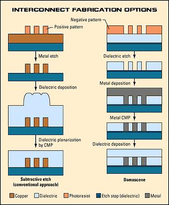

### 互联工艺的low-k材料
使用低k介质，可以减小互连之间的寄生电容，从而提高速度、降低功耗。
比较常用的材料有SiOF（FSG）、OSG（兼容Cu和CMP）

## Doping 掺杂

### Diffusion 扩散
扩散工艺是利用了高温下杂质原子在硅晶体中的扩散作用，使其从表面向硅片内部扩散，形成一定浓度和分布的杂质分布层。一般用作于MOS源漏的掺杂，不适合很浅或者是浓度很精确的沟道。

**掺杂的优点**

1. 表面损伤小
2. 价格低
3. 容易获得比较深或者高浓度的结

**掺杂的缺点**

1. 只能形成特定形状（受制于扩散方程） 
2. **各向同性**工艺，总会扩散到掩膜层下方
3. 扩散深度和表面浓度相关，不适合超浅结掺杂 
4. **高温**时间长

**过程**

硅片清洗-氧化-形成刻蚀窗口-光刻胶剥离-硅片清洗-杂质氧化物沉积-扩散推进-氧化物剥离

**影响扩散的一些因素**包括温度、点缺陷和浓度分布

Two-step diffusion 两步掺杂技术

1. 预掺杂：将掺杂剂引入到硅表面，形成一定浓度的掺杂源层。该过程为恒定掺杂浓度扩散。
2. Drive-in：恒定掺杂总量扩散。扩散驱动，持续加热更长时间，掺杂剂扩散更深。

薄膜电阻测量：四探针法、霍尔效应法

扩散结深Xj：磨角染色法

杂质浓度分布：C-V法

**扩散方法的改进**：快速气相掺杂，用于制作超浅结。

### Ion Implantation 离子注入
利用高压加速掺杂元素的离子，将其注入到硅片表面，嵌入到晶体内部，形成掺杂区域，最后使用热退火技术恢复损伤，激活掺杂原子。

**Channeling effect**

某些晶向会形成规则排列的开放通道，当离子沿着这些方向注入的时候，几乎不予晶格原子发生碰撞，能够深入穿透到晶体内部，导致掺杂不均匀。减少沟道效应的方法是：倾斜硅片，预非晶化（使用Si+使得Si表面非晶化）

**Post-impant Annealing and Activation**

离子注入后需要进行一步额外的退火操作，这是为了**修复被损伤的晶格**，并且**激活那些注入的离子**。一种常用的方式是Rapid Thermal Annealing，即快速热退火，可以**减少瞬间扩散**。还有一种比较新颖的方式是Pulsed Laser Annealing，脉冲激光退火，可以用于制备超浅结。

**离子注入法的优缺点**

优点：

* 可以**精确控制掺杂剂的浓度**与分布
* 可以独立控制浓度和结深
* 速度快，工艺时间短
* 通过多重注入实现复杂的分布
* **低温过程**
* 各向异性

缺点：

* 很多缺陷无法通过退火进行修复
* 通常比扩散的方法的杂质浓度更高
* 通常会使用一些有毒气体源
* 价格高昂

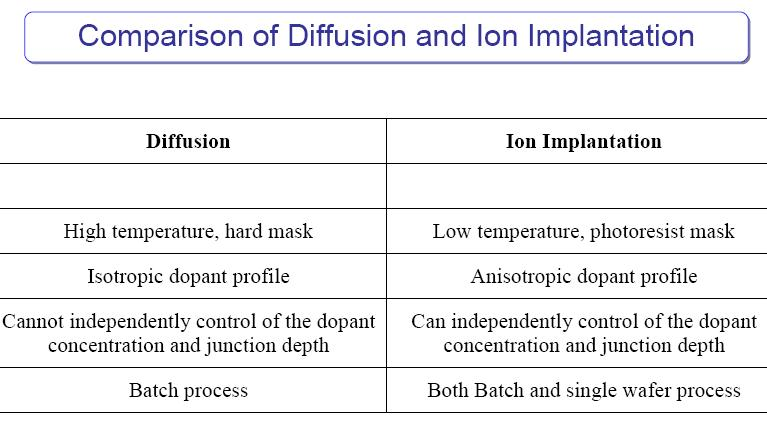

## CMOS工艺集成
**Well tap cell**是一种连接衬底或阱区到电源/地的结构，能够提供到地的低阻通道，避免Latch-up效应。

CMOS工艺一般采用100晶向的Si，因为表面态密度比较低，对阈值电压的控制比较好。为了进一步提高对阈值电压的控制，还会采用**外延生长P-epi**（掺杂更均匀，晶格缺陷少，杂质更少）

**为什么要外延一个P-epi**：1）利于n-well制备 2）降低表面杂质，缺陷，可以提高晶体管性能 3）轻掺杂，便于控制Vth。

**为什么现代CMOS工艺采用N-Well CMOS**

1. 更低的基底偏置效应
2. 较低的寄生电容
3. NMOS晶体管天然的速度更快。

当然现在也有双阱工艺能够同时结合N-well和P-well的优点。由于N-well工艺，bulk的电压和source的电压是可以相等的，某种程度上消除了基底偏置？再者就是N-well的掺杂浓度更低，会降低体效应参数。而低掺杂会导致耗尽区宽度大，进而降低了寄生电容。

**为什么采用Poly-Si**：可以用作自对准工艺，后续流程不会融化。

**自对准工艺的优点**

使用栅极作为掩膜，直接决定源/漏区域的注入位置，从而达到对齐的目的。

1. 只需要一个掩膜，工艺变简单
2. 大大减少了栅极和源漏之间的交叠电容（因为掺杂不会偏差太多，特别是使用离子注入的方式）
3. 能够降低PMOS的工作电压

**使用Silicide作为接触物**

Silicide例如NiSi是金属和Si形成的化合物，可以在源漏栅进行低电阻接触，可以抗高温退火、自对准、不容易扩散进入Si，可以和Si反应形成接触。

使用Silicide的优点：

1. 降低电阻。
2. 减少金属和Si沟道之间的电阻，提高开关速度。
3. 更稳定的界面，降低金属扩散进入Si。
4. 硅化物形成作为缓冲过渡带，减少界面缺陷，提高粘附力。

Silicide形成的过程是自对准的，只需要在已经形成CMOS结构的基础上直接沉积金属，金属和Si接触的地方会形成硅化物，而与SiO2接触的地方则不会。最后直接移除金属即可。

## FinFET

为什么要进行持续的微缩化？

1）降低寄生参数，降低功耗

2）提高晶体管的开关速度

3）增加集成度，实现更复杂的功能

4）降低成本

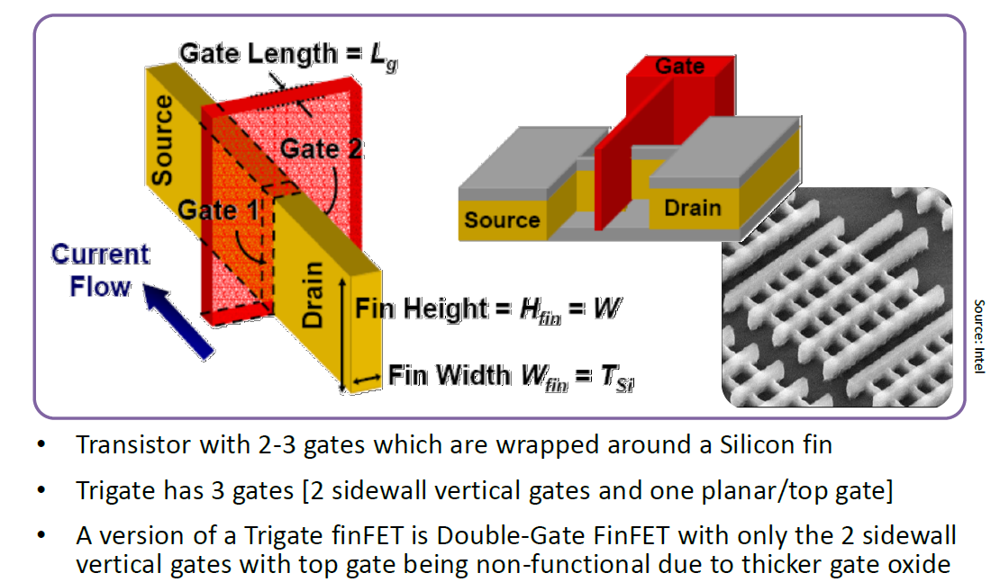

### 短沟道效应

**V-TH Roll off**：当沟道太短的时候，D实际上控制了沟道，而不是Gate。

**DIBL**：漏极导致势垒降低。漏端有电压时会导致沟道势垒的降低，电子直接通过了。
在短沟道的前提下，如果体厚度越大，D对S/沟道的耦合效应越强，栅的控制能力越弱。所以为了降低体厚度，人们研发了SOI晶体管。

### FinFET的优点
* 更好的栅极控制能力
* 更大的驱动电流
* 降低了电源功耗：提高栅极控制能力抑制了漏电流和亚阈值导通，显著降低静态功耗
* 迈向了3D集成

### FinFET的制作工艺
在缺少高分辨率光刻机的情况下，通常使用多重曝光技术：

1、LELE工艺
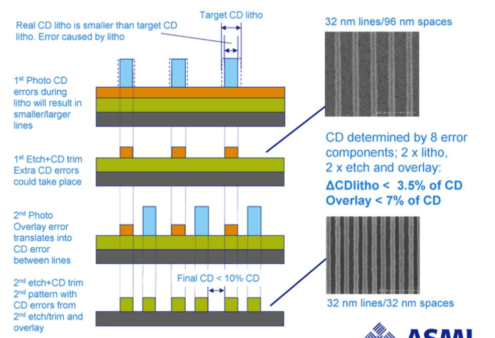

2、LFLE工艺
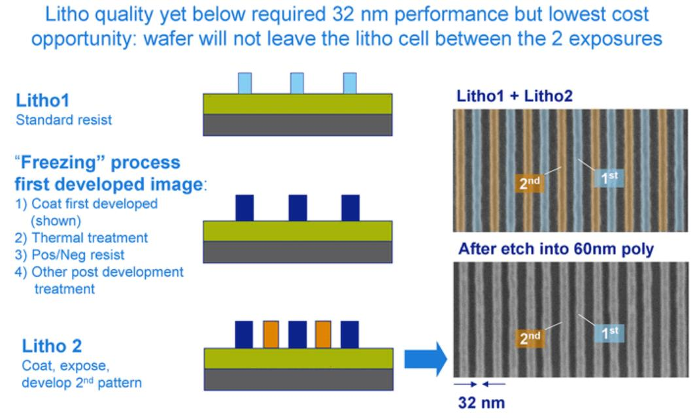

3、SADP工艺
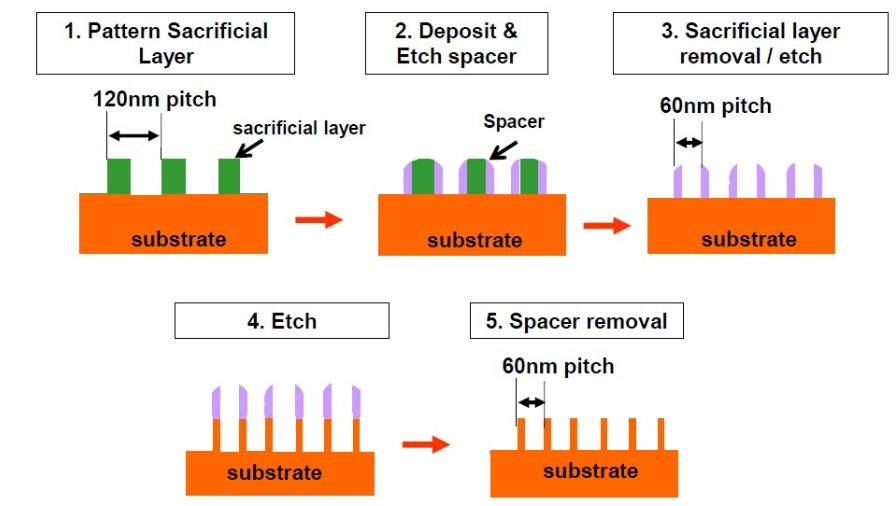

## HKMG
**High-K介质解决的主要问题**：随着沟道长度的缩小，根据等比例缩放原则，Oxide的厚度也需要进一步的下降。但是如果继续使用SiO2作为中介层，厚度将会被缩小到不能被接受，即电子隧穿效应会变得显著，漏电流增加。**在保持栅电容不变的情况下，k越高，物理厚度可以越大，有利于降低栅介质漏电**

**对High-K介质的要求**：高介电常数、**宽禁带**、能够在Si上高纯度生长，形成**良好的表面**、高热稳定性，与半导体的能带之间的**带阶**要合适。综合考虑下来，只剩下HfO2和ZrO2，以及他们的硅化物可以和Si进行比较好的结合。

如何生长HfO2？使用ALD。

ZrO2的结晶温度比较低，HfO2的结晶温度相对更高。为了进一步提高结晶温度，可以加入N。

## Metal Gate

**早期放弃Metal gate而使用Poly Si**：可以通过掺杂调控Vth，自对准工艺可以控制扩散区域，热稳定性好，后续工艺的高温不会使得Poly Si融化。

**为什么又重新回到了Metal Gate？**

1、Poly-Si和High-K介质进行结合时，PolySi表面和HighK材料之间形成了大量的**表面态**，会捕获电子或者空穴，导致**费米能级被钉扎**到某个固定位置，**无法通过自由掺杂调节Poly-Si的功函数**。因而导致了Vth偏移，nMOS和pMOS无法分别优化。

2、多晶硅的**耗尽现象**比较严重

3、多晶硅中的**掺杂原子会扩散**进入Si

**使用金属的好处**

1、没有耗尽现象
2、提高了界面质量，避免了费米能级钉扎现象
3、没有掺杂剂的扩散现象
4、更高的电导

**如何选择金属？**
PMOS要求高的功函数，NMOS要求小的功函数。需要耐高温。

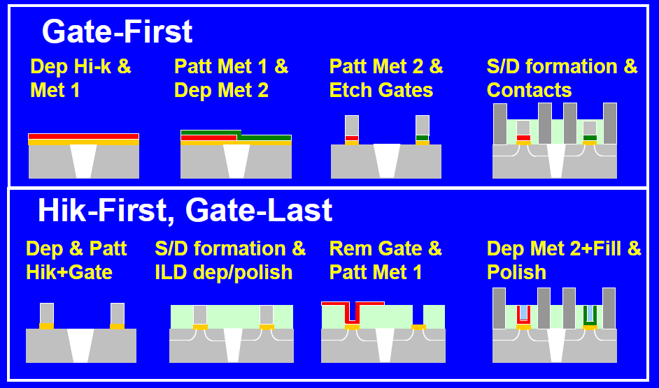

如果采用Gate-First工艺，那么进行S/D形成的高温会影响金属的性质，所以我们采用Gate-Last工艺，这样还可以利用自对准的优点。

**Cu金属互联相比于Al的优势**：
Cu电阻率低，互联损坏低；Cu熔点更高；RC延时更小，速度更快；热膨胀小；**Cu的电迁移小**

## Strain Engineering
通过施加应力改变晶体结构，从而导致迁移率、有效质量等发生变化，从而提高晶体管的速度。

1、对于PMOS晶体管，通常会施加压应力Verticle Stress，提高空穴的迁移率，常用的方法是生长SiGe。

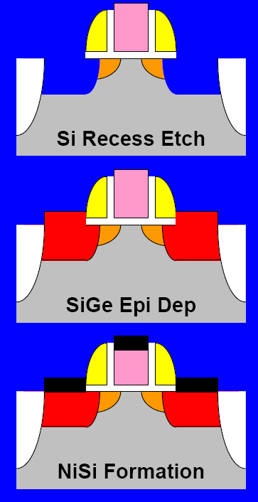

生长SiGe采用Ultra-high Vacuum CVD工艺，这是因为**SiGe极易和O元素发生反应，UHV主要为了降低气体中的氧含量**，SiGe源漏阱区的掺杂是通过通入磷烷和硼烷气体实现反应掺杂。在生长SiGe之前需要使用H2进行高温预处理，去除Si表面的一些氧化物、C污染和金属残留等。

这种方法生长出来的Ge含量过高时缺陷比较多，一种改进的方法是渐变分组SixGe1-x。可以获得更高质量的晶体、更少的缺陷、更高的Ge含量。

2、对于NMOS可以采用SiC的方法，增加沿着沟道方向的拉应力和垂直沟道的压应力。该结构还会在源和沟道之间形成一个势垒，降低了低Vds下的电流。

3、可以采用CESL技术分别对NMOS和PMOS采用不同的材料进行施加应力，该方法的缺点是间接施加，效率比较低。

4、SMT技术 Stress Memorization Technology。通过**高温退火**记住应力层引入的晶格畸变，及时应力源被移除了，但是晶体仍然保持一定的残余应力。

## MOS管结构创新
从FinFET到GAA
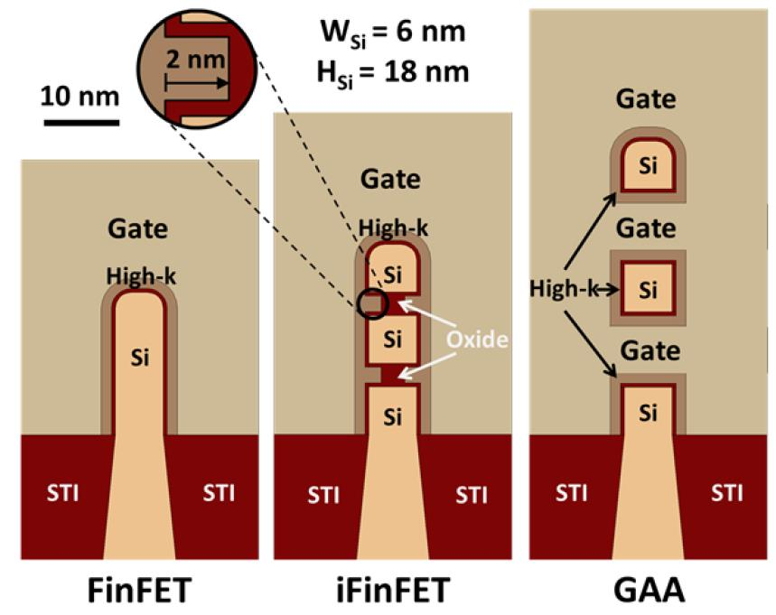

比较新的nanosheet晶体管
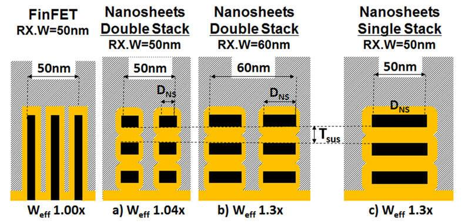

从nanosheet到forksheet，NMOS和PMOS之间的距离被被缩小
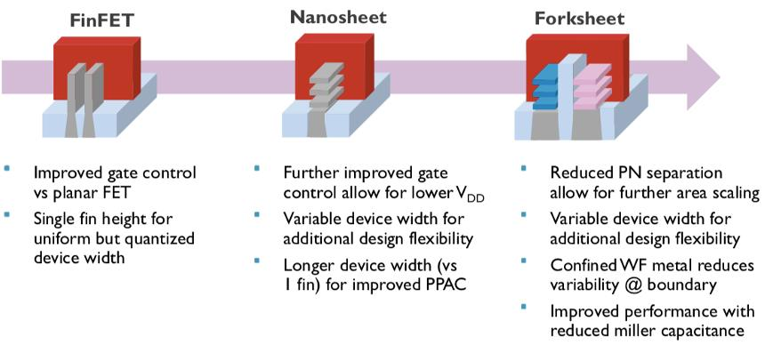

## MOS管材料创新
Ge对空穴的迁移率高，III-V族元素对电子的迁移率高，分别替代Si可以显著提高性能

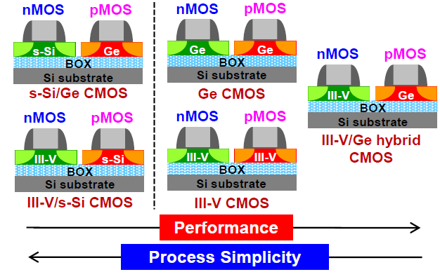

一种典型的高迁移率n型沟道半导体材料 GaAs、lnGaAs

SiC基半导体器件的优势是宽禁带材料、击穿电场更大、迁移率更高、散热更好。

