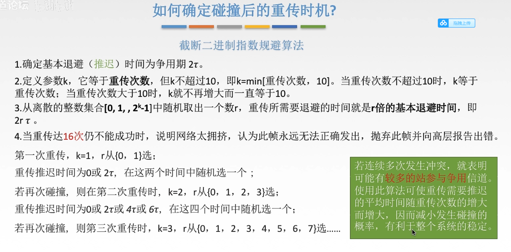

# 计算机网络

计算机网络是通过一定的技术将多台独立自主的主机相互连接起来的一个集合。

Internet是一个专有名词，指的是当前全球最大的、开放的，由众多网络互联起来的特定的计算机网络。

* 全球最大的开放性广域网
* TCP/IP 作为参考标准
* 从 ARPNET 发展出来

**为什么采用数据报的方式**

1. 轮流发送数据包，分时段处理报文，多线程处理事务。
2. 如果数据包丢失，只需要重传少量的数据包，降低出错开销。
3. 数据可以采用不同的路径，数据包可以单独传输。

不同层次的数据有不同的名称

| 使用范围	| 单元英文	| 单元中文 |
| ---------- | -------- | --------- |
|数据链路层	|frames	|帧 |
|网络层	|packets	|报文 |
|运输层	|segments|	段 |

**OSI参考模型**

由ISO组织提出，将网络划分为7个层次，每个层次有自己的特有的任务。下层向上层提供服务，层与层之间有接口，上层使用原语调用下层提供的服务。

| 层次         | 特点                   | 关键字                     | 备注            |
|--------------|------------------------|----------------------------|-----------------|
| 应用层       | 给用户展示交互接口     | 浏览                       | 属于应用层      |
| 展示层       | 展示                   | 标准                       | 属于应用层      |
| 会话层       | 进程之间通信如何交流   | 对话和交流                 | 属于应用层      |
| 传输层       | 终端到终端通信         | 可靠性，流控制，错误纠正   | 属于数据流层    |
| 网络层       | 路径选择               | 路径选择，最优路径         | 属于数据流层    |
| 数据链路层   | 介质访问               | 帧和介质访问控制           | 属于数据流层    |
| 物理层       | 二进制传输             | 信号和介质                 | 属于数据流层    |

分层实现了功能的解耦，标准化了接口，每层与每层之间标准化处理。分层还可以保证每层之间相互独立地发展。

**TCP/IP参考模型**

只有四层，将OSI的上三层进行合并成为应用层，将所有与应用程序相关的问题合并到一个层中，确保数据正确被打包到下一层。

* 应用层：与应用相关的表示、编码和会话控制
* 传输层：应用程序到应用程序之间的对话，处理服务质量的可靠性、流量控制拥塞控制和错误纠正，主要有TCP和UDP协议
* 互联网层：主机到主机的寻址和路由Routing/Forwarding，最佳路径的确认发生在这一层，主要是IP协议
* 网络接入层：完成物理实现和物理介质控制，包括OSI的数据链路层和网络层

**典型的网络设备**

| 特性      | 集线器（Hub）    | 网桥（Bridge）      | 交换机（Switch）           |
| ------- | ----------- | --------------- | --------------------- |
| 工作层     | 物理层（第一层）    | 数据链路层（第二层）      | 数据链路层（第二层）            |
| 作用范围    | 一般用于同一个广播域  | 可连接两个局域网        | 可连接多个设备，分隔冲突域         |
| 传输方式    | 广播          | 根据 MAC 地址转发     | 根据 MAC 地址转发           |
| 智能程度    | 无智能，盲目转发    | 有简单决策能力（学习 MAC） | 高智能，学习 MAC 并转发        |
| 冲突域     | 所有端口同属一个冲突域 | 两端口是两个冲突域       | 每个端口是一个冲突域            |
| 广播域     | 所有端口同属一个广播域 | 默认不隔离广播域        | 所有端口同属一个广播域（除非划 VLAN） |
| 速度性能    | 慢，冲突多       | 中等              | 快，支持全双工、高速传输          |
| 是否支持全双工 | 否           | 否               | 支持                    |
| 常见应用    | 早期 LAN，已淘汰  | 小型网络连接          | 常见于现代局域网              |

对比路由器和交换机

| 特性             | 路由器（Router）                | 交换机（Switch）                  |
| -------------- | -------------------------- | ---------------------------- |
| **工作层**        | 网络层（第三层）                   | 数据链路层（第二层）                   |
| **主要功能**       | 连接**不同网络**，进行**IP寻址和路由转发** | 在**局域网内部**连接设备，通过**MAC地址转发** |
| **是否看 IP 地址**  | ✅ 是，做三层路由                  | ❌ 否，只看 MAC 地址                |
| **是否看 MAC 地址** | ✅ 是（用于ARP、封装）              | ✅ 是                          |
| **是否隔离广播域**    | ✅ 是（每个接口一个广播域）             | ❌ 否（所有端口默认同属一个广播域，除非配置 VLAN） |
| **是否隔离冲突域**    | ✅ 是                        | ✅ 是（每个端口一个冲突域）               |
| **典型端口数**      | 少（通常4个LAN + 1个WAN）         | 多（8口、24口、48口常见）              |
| **是否支持NAT**    | ✅ 是（路由器核心功能之一）             | ❌ 否                          |
| **是否支持DHCP**   | ✅ 常支持，自动分配IP地址             | ❌ 否                          |
| **常见用途**       | 连接局域网和外网、跨网段通信             | 局域网内部连接设备                    |

## 物理层

物理层负责的功能是实现bit流的传输，涉及到**编码与调制**，**复用**和**纠错**问题。

**码元**：如果一个周期有K种信号，那么1码元=log_2 K bit

波特率=每秒传输的码元数量 Baud

比特率=每秒传输几个比特=Baud*n，其中n是一个码元可以携带的bit数量

### 编码

#### 编码理论

**无噪声信道的最高传输速率**

$$
    C = Wlog_2L \space bps
$$

其中L表示码元能够表示的信息数量，可以是2、4、8等等。W是信道的带宽，以Hz为单位。

对于一个理想低通信号，最高频为W的话，那么上述公式应该是2W。

**有噪声信道的最高传输速率**

$$
    C = Wlog_2(1+\frac{S}{N}) \space bps
$$

其中$\frac{S}{N}$被称之为信噪比，W为带宽。

#### 数字编码技术

1、单极性编码，用零电平表示0，高电平表示1

这种方法难以区分连续的0和1，需要有很严格的时钟进行同步。同时持续的0和1还会带来直流电平积累问题。

2、Not Return Zero编码

用负电平表示 0，正电平表示 1（或相反），一定的中和。

缺点是：难以分辨一位的结束和开始，要有时钟同步，仍然有直流电平的积累。

3、归零编码

用负电平表示 0，正电平表示 1（或相反），比特中位跳变到零电平，从而提供同步。

优点是本身具有同步信息，缺点是需要采用3个电平表示1bit，占用了带宽。

4、曼彻斯特编码

每一位中间都有一个跳变，从低跳到高表示 0，从高跳到低表示 1

自带时钟信号，但是编码效率为50%。

5、差分曼彻斯特编码

在时钟信号起始处有跳变是0，没有跳变是1。

### 复用

由于一条线路的传输能力远超一个用户信号所需要的能力，为了提高线路利用率，经常让多个信号共用一个物理线路。

#### 时分复用 TDM

将时间划分为等长的时分复用帧，每个用户在TDM帧中占用固定序号的时隙。每个用户占用的时隙是周期出现的，在不同的时间占据相同的频带宽度。

时分复用可能会造成线路资源的浪费：使用时分复用系统传送计算机数据时，由于计算机数据的**突发性质**，用户对分配到的子信道的利用率一般不高。

#### 统计时分复用 STDM

不是固定时间就发送，而是一旦有了就发送。不按照时间来划分用户，所以需要帧自己携带用户信息。

#### 频分复用 FDM

用户分配到一定的频带后，就一直占用这个频带。所有的用户在相同的时间内占用不同的频带。

#### 码分复用 CDM

基站产生相互独立的bit序列来表示，取反得到的序列来表示0。多个用户发送的码可以进行叠加，只需要进行一个点积操作就知道用户发送的是1还是0，还是没有发送数据。这种编码得到的频谱近似于白噪声，不易于信息泄露。

具体的计算过程，进行规范化内积后得到为+1，说明发送的是bit1，得到-1，说明发送的是bit0，如果得到0，说明没有发送数据。

### 物理层的设备

**中继器**：只负责信号的整形与放大，使得信号可以传播到更远的距离

**集线器Hub**：本质是端口更多的一个中继器，不能隔绝冲突域，不能多个端口同时发送数据

## 数据链路层

数据链路层利用了物理层比特传输的服务，向网络层提供IP数据报封装成帧，传输给下一个相邻节点的功能。

数据链路层解决封装成帧，差错控制，流量控制问题，即如何在不稳定的链路上为网络层提供一个可靠的、无差错的、面向帧的点到点或点到多点的数据传输服务。

数据链路层的协议明确了链路上交换的数据格式，链路上的两个节点的行为。

### 封装成帧

封装成帧是保证帧定界和透明传输。

1、字符计数法

在最开始用一个定长的技术字段来说明帧长。但如果有一个出错了，后面就全部错了。通常也不会使用。

2、字符填充法

在帧的开头和结尾加入特定的一个bytes序列。同时还要扫描帧内部，如果发现冲突的内容，需要在前面加入ESC转义字符。

3、0bit填充法

在开头和结尾加上01111110这个特殊的序列，扫描中间数据部分，如果连续出现5个1就在后面加1个0。

4、违规编码法

采用一些特殊编码的时候，可以刻意违背编码方式从而界定帧。

### 差错控制与纠错

差错控制有两个粒度，一个是只检错，发现错就丢失；另外一种是引入纠错码，有一定的修复能力。

可靠传输要保证数据有序，数据不重复，帧不丢失。

#### 奇偶校验码

分为奇校验和偶校验，一般无法检测出多个bit出错的情况。

对于偶校验，只需要对后续的bit进行异或运算即可得到码。接受方对所有bit进行xor运算，如果结果为1说明出错了。

对于奇校验，整个校验码（包括信息位和校验位）中1的个数为奇数个。

#### CRC 循环冗余校验码

可以检测连续的错误，只要不超过校验位长度的连续错误。

#### 海明码

校验码的位数根据信息的长度来定，分组进行校验。具体的检测方法参考PPT

[点击查看海明码的计算过程](./pdfs/海明码.pdf)

### 流量控制与可靠传输

这两个机制都可以通过滑动窗口机制来实现。

重点关注停止等待协议，回退N帧协议和选择重传机制。

这几种策略的不同点在于：1、确认机制；2、重传机制；3、滑动窗口大小

#### 停止等待协议

窗口大小均为1，接收方要发送ACKI，发送到超时没有收到确认会重传。

#### 回退N帧协议 GBN

发送窗口大于1，接受窗口等于1。返回ACKI，超时重传。

接收方可以累积确认，连续收到多个数据帧的时候，只确认最后一个帧；发送方如果超时没收到ACKI，则重传i及其之后的所有帧。

注意如果使用n bit来标记编号，则WT+WR<=2^n，否则超时重传的时候，会被认为是下一个窗口的正常数据被错误地接收。

#### 选择重传SR协议

接收和发送窗口均大于1，但是要保证接收窗口小于等于发送窗口。

确认是一帧一帧进行的；如果发现有错误，则直接发送NAKI帧。

超时没接收到ACKI，则会重传第i帧；如果收到NAKI帧，直接重传。

### 介质访问控制

主要解决在共享信道上谁来发送数据的问题。常见的协议有CSMA/CD(以太网802.3)、CSMA/CA(无线局域网802.11)

#### 纯ALOHA
准备好数据帧就发送，如果超时没有ACK就等待一段时间再发送。改进版是时隙ALOHA，只在特定的时隙发送数据，避免了发送数据的随意性，降低冲突率。

#### CSMA协议

在发送之前先监听一下信道，空闲的时候直接发送数据。但是这会导致多个信道同时发送数据而冲突。

#### 802.3帧

* 前导码：前7bytes为同步码，后1bytes为帧界定符。
* 源地址和目的地址：各6bytes的MAC地址
* 长度/类型字段：2bytes，大于1500的为上层协议类型
* 数据部分：46-1500B，最小为46B，小于的需要填充字段
* 填充字段
* FCS帧校验序列：4bytes

最小帧长为64 Bytes，最大帧长是1518 Bytes，口诀 6 6 2 N 4

以太网是一个广播网络，帧会被总线上的所有设备监听到，设备需要查看帧是否要传输给自己，不是的话抛弃掉。

#### 无线网帧

有三种帧格式

* 控制帧
* 管理帧
* 数据帧

其中数据帧和802.3差不多，但是数据载荷会更多，而且还会包括序号和确认信息。

802.11帧的头部会有标志说明帧是去往AP还是来自AP，无线局域网的两个移动设备不能直接通信，需要经过AP进行转发。

#### CSMA/CD协议

先听再发，边听边发，冲突停发，随机重发。

带冲突检测的载波侦听多路访问协议，适用于总线结构的以太网。CSMA/CD协议可以实行的重点在于以太网中的载波是可以被监听的。由于以太网的传输质量比较高，所以该层并没有进行ACK确认，当数据发生差错的时候，是由上层的协议负责重新发起传输。这和CSMA/CA不同，因为无线传输无法监听载波，而且无线传输的传输差错概率高，所以在802.11的帧格式中存在一个序号，是为了进行重传的。

重点关注CSMA/CD协议中的重传时机，根据k失败次数，指数地随机确定一个重传时间。但超过16次失败就直接躺平，报告给上级。

由于边发边监听，一些太短的帧可能会导致冲突了而不知道，所以规定了最短帧长64B。

#### CSMA/CA协议

协议要点：发送方先监听后发送，如果信道忙则随机退避，如果信道空闲则间隔DIFS后一口气发送帧，不进行监听。随机退避的时间使用二进制指数算法随机确认，发送方会持续监听信道，只有闲的时候才持续扣除倒计时，倒计时结束后立即发送帧。接收方使用停止等待协议，得到一个正确的帧就会发送ACK，如果发送方超时没有收到ACK则进行随机避让。

在无线局域网中，常常会出现两类问题

* 隐藏站问题：当 A 将数据传输到 B 时，C 无法检测到 A 和 B 之间的传输，因此 C 可能会决定将数据传输到 B 并导致 B 发生冲突。为了解决隐蔽站问题，发送方可以广播RTS控制帧预约时间，AP会广播CTS控制帧，其余站点接收到这个帧则会自动禁言一段时间。
* 暴露站问题：当 B 将数据传输到 A 时，C 可以检测到传输，因此 C 不会将数据传输到 D。但这是一个错误。（听到不应该听到的信号）

为什么我们不使用CSMA/CD协议：

1. 碰撞检测要求本站点在发送数据的同时不断监听信道，但是对于无线信号来说，信号十分微弱，很难监控
2. 即使监控了，也很难避免碰撞的发生。

### 局域网

覆盖比较小的地理范围，较低的时延和误码率，支持单播、广播和多播技术。

有线局域网：主要是802.3以太网，之前还有IBM的令牌环网。以太网也分为双绞线以太网和光线以太网。双绞线以太网现在主要是由交换机进行连接，如果是全双工的交换机则不用争抢信道。

无线局域网WLAN：主要是802.11/WiFi，通常是一个AP＋多个终端，需要使用CSMA/CA协议避免冲突。

## 网络层

网络层将传输层的数据封装成IP数据报，网络中的路由器根据IP数据报的首部中的源IP地址和目的IP地址进行“分组转发”。网络层实现了从主机到主机的传输。网络层的关键词是路由和转发。

网络层还负责实现拥塞控制和流量控制。拥塞控制有两种方法：开环方法，即事先设计好预防拥塞的方法；闭环方法，动态监视网络的状态。

网络层的核心协议是IP协议，除此之外还有

* ARP协议：查询网络中主机的<ip地址，MAC地址\>映射对
* ICMP协议：网络层实体之间相互通知“异常事件”
* IGMP协议：用于实现IP组播

### IPV4

**IPV4数据报**

* 首部长度，4bit，以4B为单位。基本首部长度20B，可以拓展到60B
* 总长度0-65535，总长度涵盖首部和数据部分
* 标识，16bit，是一个自增序号
* 标志，3bit，表示是否还有下一个片段。因为要受数据链路层MTU长度的限制，有的路由器可能会将长的IP数据包进行分片，每一个分片都有首部。
* 片偏移，13bit，表示数据部分在被分片前的位置，以x8B为单位。所以除了最后一个分片，其余分片的长度都必须是8B的整数倍
* 生存时间段，8bit，每经过一个路由器就会被减1，如果减到0还没有被送达就会发出一个ICMP报文提示无法送达
* 协议，8bit，用于区分TCP和UDP
* 首部校验和，checksum，16bit，只校验首部

**IPV4地址的分类**

特殊的地址

主机号全1表示广播地址，主机号全0是保留地址

### 子网划分技术

当主机号数量大于我们所需要的数量的时候就会造成浪费和管理不方便，为此我们可以再主机号里面抽取一些bit当做网络号，即划分子网。

子网划分出来后有利于提高网络的安全性和隔离性，减少广播域和提高网络性能。

子网掩码指定了网络号和主机号，网络号位被置1，主机号置0。如果一个网络进行了子网划分，那么网络中的每个主机，路由器的每个端口都需要设置子网掩码。

默认网关：当一个网络中的主机想访问另外一个网络的时候，需要将数据包发送到默认网关，默认网关负责将数据进行转发。当然这需要提前使用ARP协议将默认网关的MAC地址获取出来。

默认路由的网络号和子网掩码全为0，可以和任何IP地址匹配上。

### CIDR

网络前缀可变长，分配地址的时候更加灵活，可以降低IP地址的浪费。

传统定长子网划分技术每个子网的主机数量是一致的，容易造成浪费。

一个最小的子网，**最少需要2bit作为主机号**，分别是主机，路由器端口，全0和全1这两个特殊的地址。

**路由聚合**：对于路由表中几个转发接口相同，部分前缀也相同的路由表项可以进行合并，可以减小表项，提高查表的速度。在转发查表的时候，应该遵循最长前缀匹配原则。

### NAT

Network Address Translation，网络地址转换技术。可以让私有IP地址访问外部网络设备，而不必为每个设备都分配一个公网IP地址，比如192.168.x.x，10.x.x.x。这样的好处有：1、地址复用；2、节约公网地址资源；3、屏蔽内部结构，增强安全性，公网无法直接访问私有网络中的主机。

NAT实际是运行在传输层的，因为它需要在NAT表中建立ip号+端口号的映射。这是由于公网IP地址只有一个，我们需要用端口号来区分不同的服务进程。

### ARP

ARP协议是独立于IP协议的，用于确定<mac地址，ip地址\>的映射关系。每一个网络适配器都会有自己独立的mac地址。

* ARP请求分组：内容包括我是谁（我的MAC地址和IP地址），我要找谁（IP地址）。然后封装成MAC帧，MAC地址全，源地址是Y（本人MAC地址）
* ARP响应分组：回复一个单播帧，我的IP地址是xxx，我的MAC地址是xxx

比如当我们想要找默认网关的MAC地址的时候，源主机会广播一个ARP请求分组，只有路由器会回复一个单播帧。此时源主机就知道了路由器的MAC地址，并将其记录到ARP表中，下一次发送IP数据报的时候就知道封帧使用什么MAC地址了。

### DHCP协议

通过给刚接入网络的主机分配IP地址、默认网关和子网掩码。使用C/S模型。
DHCP是应用层协议，基于UDP实现，客户端口为68，服务器端口为67

1、Discover报文：C->S。我的MAC地址是XXX，请给我们分配一个IP地址。IP地址会被填充为0.0.0.0，目的IP地址是255.255.255.255。帧也是广播帧。

2、Offer报文：S->C。将要分配的IP地址，租用时间，默认网关和子网掩码报告出去。该帧是一个单播帧。

3、Request报文：此时源IP地址还是全0，目的地址是全1，目标MAC地址还是全1。这是因为一个子网里面可能有多个DHCP服务器，多个服务器都会给源主机发送Offer报文。所以我们需要一个Request报文广而告之所有的DHCP服务器，我到底接受了哪个IP地址。

4、Acknowledge报文。

### IPV6

IPV6地址为128位，数量足够多。首部变成固定40字节，使用拓展头机制。

| 对比维度     | IPv4         | IPv6             |
| -------- | ------------ | ---------------- |
| 地址长度     | 32 位         | 128 位            |
| 地址数量     | ≈ 42 亿       | 极其庞大             |
| 表示方式     | 点分十进制        | 冒号十六进制           |
| NAT 是否需要 | 是            | 否                |
| 安全机制     | 选配 IPsec     | 默认支持 IPsec       |
| 广播支持     | 支持           | 不支持广播，只支持组播 / 任播 |
| 自动配置     | 限于 DHCP      | 支持自动配置，无需 DHCP   |
| 网络效率     | 较低，需复杂处理     | 更高效，结构清晰         |
| 发展现状     | 全球广泛部署，地址已枯竭 | 正逐步部署，未来趋势       |
| 分片机制     | 可在主机和路由器分片 | 只允许在主机分片 |

### 转发过程
### 拥塞控制

## 路由算法

| 比较维度   | 静态路由（Static Routing） | 动态路由（Dynamic Routing）   |
| ------ | -------------------- | ----------------------- |
| 配置方式   | **手动配置**，管理员设定每条路由   | **自动学习**，通过协议自行学习并更新路由表 |
| 适应网络变化 |  不自动更新，需要人工干预       |  自动感知链路变化，快速更新         |
| 占用资源   | 少，计算量和内存开销低          | 多，需要额外 CPU 和内存开销        |
| 配置复杂度  | 简单（网络小）/ 麻烦（网络大）     | 自动（适合大型或复杂网络）           |
| 故障恢复速度 | 慢（需手动更改）             | 快（自动选择替代路径）             |
| 安全性    | 高（不受外部路由影响）          | 稍低（可能受到路由欺骗等安全问题）       |
| 适用场景   | 小型网络，结构稳定            | 大中型网络，拓扑频繁变化            |

路由算法分类

| 分类方式        | 类型              | 示例协议                 |
| ----------- | --------------- | -------------------- |
| **按自治系统划分** | **IGP**（内部网关协议） | RIP、OSPF、IS-IS、EIGRP |
|             | **EGP**（外部网关协议） | BGP                  |
| **按算法划分**   | 距离矢量（DV）        | RIP、BGP              |
|             | 链路状态（LS）        | OSPF、IS-IS           |
|             | 混合型             | EIGRP                |

### 距离向量算法

和**相邻邻居**交换路由信息，更新自己的路由表。代表算法是RIP，它使用UDP协议封装。距离路径算法以跳数作为衡量的指标metric。

优势是算法速度快，时间复杂度和空间复杂度都比较低。

劣势是好消息传得快，坏消息传的慢。比如当有一个路由器断开之后，代价会慢慢累加到无穷。一个可行的改进方法是引入最大跳数限制，比如RIP中限制为16。

### 链路状态算法

使用洪泛的方法将自己的路由表广播到整个网络，每个路由器都可以获得全局的路由信息，根据这个路由信息可以构建网络拓扑，进而使用迪杰斯特拉算法来构建到每个结点的最短路径。代表算法OSPF，它使用IP协议封装。

优点是收敛速度快，只计算一次路径，稳定性高。
缺点是时间复杂度比较高，资源开销大。洪泛会带来大量的资源浪费和带宽占用。

### 路径-向量路由算法

这是一种在自治系统之间使用的路由算法。不仅记录了下一跳，还记录了完整的路径信息。代表算法BGP。

由于不同AS之间使用的度量代价是不同的，所以域间的路由使用“代价”作为度量是不合理的，所以寻找最佳路由是没有意义的。自治系统之间的路由选择还应该考虑经济、政策等方面。所以BGP只是要寻找一个可以到达的路由，而不是最佳路由。

优点是可以进行灵活的政策控制，有效避免了换路的发生。

具体过程：每一个AS需要选择BGP发言人，相邻的BGP发言人使用TCP协议发起BGP会话交换路由信息。

## 传输层

## 应用层