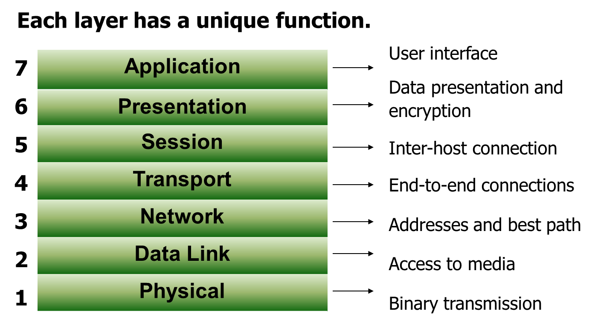

# 计算机网络

计算机网络是通过一定的技术将多台独立自主的主机相互连接起来的一个集合。

Internet是一个专有名词，指的是当前全球最大的、开放的，由众多网络互联起来的特定的计算机网络。

* 全球最大的开放性广域网
* TCP/IP 作为参考标准
* 从 ARPNET 发展出来

**为什么采用数据报的方式**

1. 轮流发送数据包，分时段处理报文，多线程处理事务。
2. 如果数据包丢失，只需要重传少量的数据包，降低出错开销。
3. 数据可以采用不同的路径，数据包可以单独传输。

不同层次的数据有不同的名称

| 使用范围	| 单元英文	| 单元中文 |
| ---------- | -------- | --------- |
|数据链路层	|frames	|帧 |
|网络层	|packets	|报文 |
|运输层	|segments|	段 |

**OSI参考模型**

由ISO组织提出，将网络划分为7个层次，每个层次有自己的特有的任务。下层向上层提供服务，层与层之间有接口，上层使用原语调用下层提供的服务。

| 层次         | 特点                   | 关键字                     | 备注            |
|--------------|------------------------|----------------------------|-----------------|
| 应用层       | 给用户展示交互接口     | 浏览                       | 属于应用层      |
| 展示层       | 展示                   | 标准                       | 属于应用层      |
| 会话层       | 进程之间通信如何交流   | 对话和交流                 | 属于应用层      |
| 传输层       | 终端到终端通信         | 可靠性，流控制，错误纠正   | 属于数据流层    |
| 网络层       | 路径选择               | 路径选择，最优路径         | 属于数据流层    |
| 数据链路层   | 介质访问               | 帧和介质访问控制           | 属于数据流层    |
| 物理层       | 二进制传输             | 信号和介质                 | 属于数据流层    |

分层实现了功能的解耦，标准化了接口，每层与每层之间标准化处理。分层还可以保证每层之间相互独立地发展。

**TCP/IP参考模型**

只有四层，将OSI的上三层进行合并成为应用层，将所有与应用程序相关的问题合并到一个层中，确保数据正确被打包到下一层。

* 应用层：与应用相关的表示、编码和会话控制
* 传输层：应用程序到应用程序之间的对话，处理服务质量的可靠性、流量控制拥塞控制和错误纠正，主要有TCP和UDP协议
* 互联网层：主机到主机的寻址和路由Routing/Forwarding，最佳路径的确认发生在这一层，主要是IP协议
* 网络接入层：完成物理实现和物理介质控制，包括OSI的数据链路层和网络层

## 物理层

## 数据链路层

## 网络层

## 传输层

## 应用层