# 操作系统概述

## 什么是操作系统

操作系统是位于计算机用户和硬件资源中间的一层软件系统，目的是可以对 **硬件进行管理和抽象**，为用户提供服务。提供一个Runtime Environment，与**设备无关**的运行环境。它为用户程序提供硬件资源的抽象abstraction，管理和分配计算机硬件资源，允许同时运行程序、共享内存、共享设备。

### 操作系统中的抽象

抽象可以给上层提供更方便的访问机制，同时抽象可以对内部细节进行保护。

1. Thread：一个指令序列，好像拥有了整个机器
2. Address Space：一个私有的、连续的好像无穷大的寻址范围。
3. File：一段持久化存储的信息，可以按照文件名进行读写
4. IO Device：一个可以读写控制的对象

### 如何实现保护

为了让多个程序同时运行，需要确保一个程序的bugs或者恶意行为不会对整个系统造成影响，此时需要操作系统进行保护：

* 用户无法和硬件直接接触
* 用户进程无法访问内核资源
* 用户程序不应该对操作系统或者其他程序产生影响

为了保证操作系统的绝对地位：

* 拥有**特权级指令**，因而区分了内核态和用户态。
* 对用户地址空间进行划分，可以支持共享和保护。

### 中断 Interrupt

一种打断CPU正常工作的机制，包括IO中断、系统调用和异常、时钟中断

系统可以配置一个IDT核和一个记录IDT起始位置的寄存器来找到所有的中断处理程序的入口。中断处理程序的参数位置需要操作系统设计者进行规定。
中断发生之后是否由硬件来保存某些参数是由ISA规定的。对于x86，硬件会负责保持PC/SP/一些状态位到Kernel Stack以保证安全，其余的寄存器由中断处理程序进行保存。恢复的时候，中断处理程序会先恢复寄存器信息，然后iret指令会负责恢复PC/SP和PSW。

**当处理中断的时候又发生了一次中断怎么办？**

* 关闭中断，其余中断信息暂时被屏蔽
* 分为top-half和bottom-half。前者关闭中断保存一些必要的状态信息并且将任务放到一个队列里，后者开启中断处理剩下的事务。这是Linux内核采用的机制。

## 操作系统的启动过程

CPU Reset之后从一个规定的位置开始执行代码。 BIOS程序找到可引导设备，将第一个512Bytes加载到内存中，然后设置0x7c00位置开始执行，然后加载更多的代码到内存中，然后找到操作系统的main函数？

## 操作系统的架构

### 宏内核

所有模块运行在内核态，使用模块化（可以加载卸载服务）、抽象（Everything is a FILE）和分层（User mode / Kernel mode）控制复杂度。
内核中有一个地方出问题会影响整个系统的稳定性；但不需要频繁的进行内核态和用户态的切换。

### 微内核

只保留最核心的功能在内核部分，其余的功能在用户态实现。稳定性好但是效率低。

## 进程与线程

### 程序 VS 进程

程序可以视作是**状态机的静态描述**，描述了所有可能的程序状态。程序动态起来就成为了一个进程，是操作系统对正在运行的程序的一个抽象。
进程定义了操作系统进行资源分配和管理的粒度，刻画了并发执行和提供调度的粒度（当然更准确来说应该是线程）

状态机的状态可以通过PCB来刻画。

**操作系统=状态机的管理者**

**在Windows里面**

* 创建 spawn
* 销毁 _exit()

**在UNIX里面**

* 创建 fork()
* 复位状态机 execve()

**fork**

立即复制一个状态机，部分状态，例如寄存器状态，打开文件列表。但是pid这个属性没有被复制。进程的地址空间会被直接共享，并且采用lazy的机制，即只有子进程发生了内存写才会拷贝一份。

父子进程会得到相同但是分离的地址空间，父子进程之间是并行的，具体的行为需要考虑调度器。

假如创建出来的子进程的父亲进程被销毁了，那么该进程成为“孤儿进程”，在UNIX中会被1号进程托管。但是也有可能会被user的systemd托管。

**execve**

复位一个状态机，回到最初的起点。复位只复位了程序可见的部分状态，操作系统内部的状态并没有被复位，比如ppid。

execve是执行一个程序的唯一的系统调用。我们可以发现UNIX Shell中打开任意一个程序，用strace去观察，第一个执行的总是execve(filename, argv, envp)。

### 进程的终止
本身没有结束自己的能力，需要系统调用SYS_exit，库函数exit对其进行了封装。

exit还会刷新缓冲区，执行一些额外的操作。_exit则是直接发生系统调用结束进程和当前组的进程。

**僵尸进程**指的是那些已经结束执行但是PCB还没被回收的进程。

### 进程的生命周期

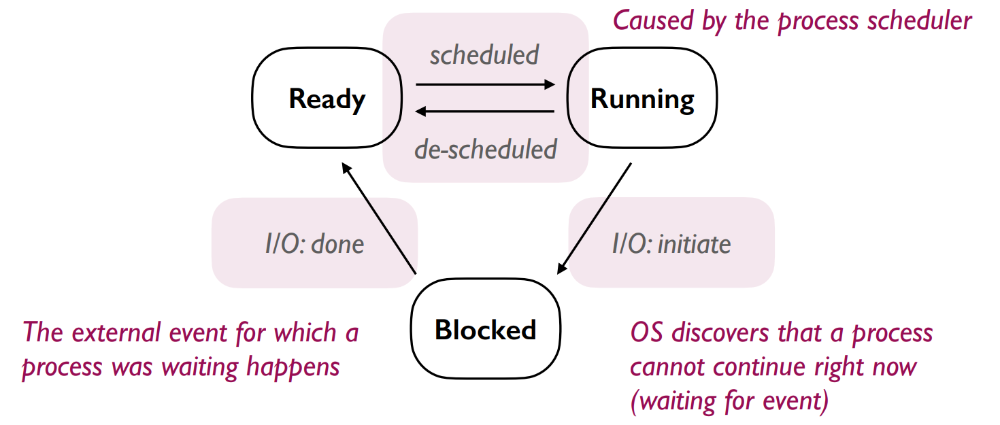

重点：进程的七状态模型

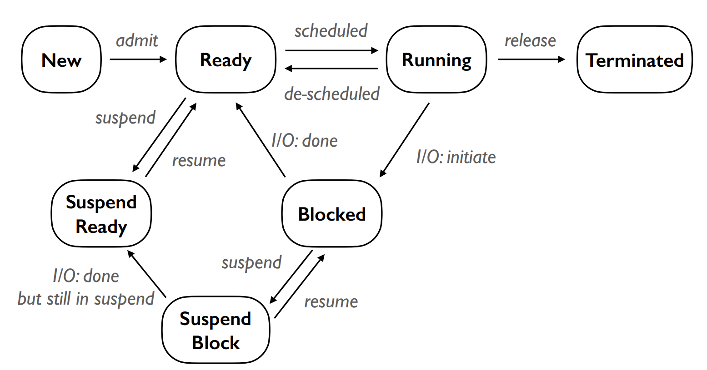

suspend态的引入使得在有限的内存空间里面可以执行多个进程，一些不需要的进程可以暂时被交换到磁盘的swap分区，某种程度上相当于拓展了内存的有效空间。

### 上下文切换

Context可以视作是程序的一些状态的描述，包括寄存器状态。btw，由于操作系统会对地址空间进行隔离，所以一般切换上下文的时候不会对内存的值造成影响。Context可以保留到Kernel Stack或者指定的一个安全的位置，这个切换的程序一般是一段汇编代码。

一个进程不仅有用户态上下文，还有内核态上下文。当一个进程正在内核态的时候被切换，需要保存内核态的一些信息，从而能够实现后续的恢复。

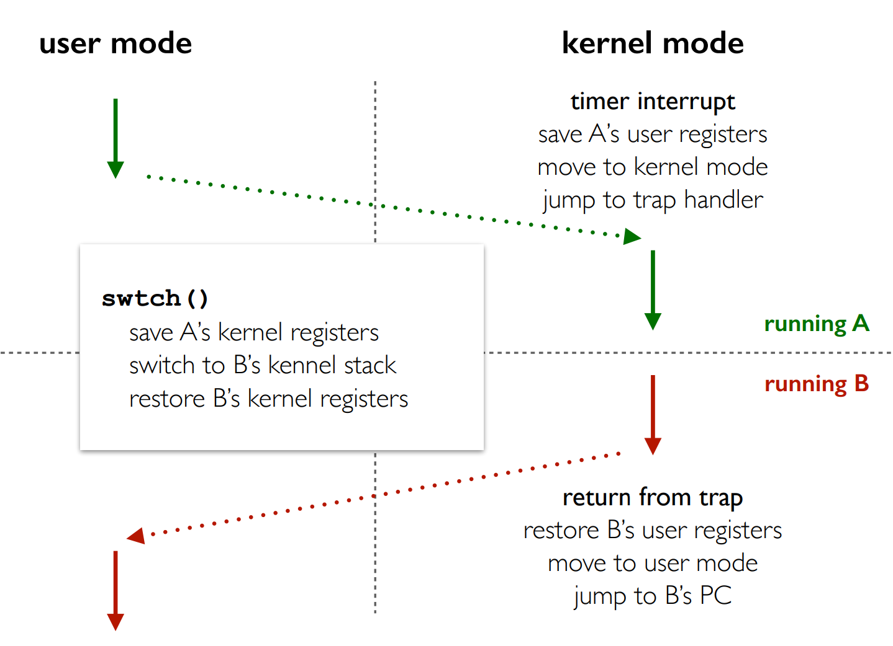

### 进程间通信

常见的进程间通信的方式包括：

* 管道
* 信号
* 信号量：主要用于同步，不传输数据 
* 消息队列
* 套接字(socket)：还可以跨主机进行通信
* 直接共享内存：使用mmap映射同一片内存区域实现通信

### 进程的地址空间

进程的地址空间是划分为一个段一个段的，每个段都有各自的权限。如果想知道有什么段可以问问GPT捏。

如何修改一个进程的地址空间？使用 **mmap**系统调用。 

mmap可以申请一片内存空间，还可以进行文件映射。

我们可以使用pmap来查看一个进程的地址空间。对于Linux操作系统，实际上是访问了/proc/pid/目录下的信息

**Everything is a FILE**：在UNIX操作系统中，映射一个大文件十分迅速，我们只访问其中的一小部分。

## 线程
为了将资源分配管理和执行序列分开，我们引入了线程。

同一个进程下的线程是共享一个地址空间，具有相同的code/data，以及资源。每个线程有自己的PC，CPU Regitsers以及Stack。

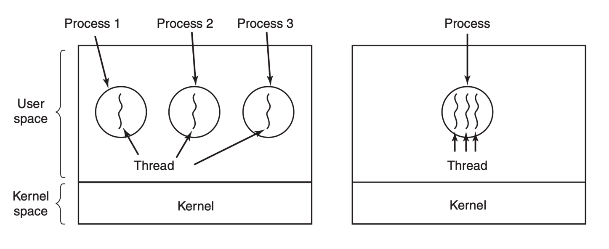

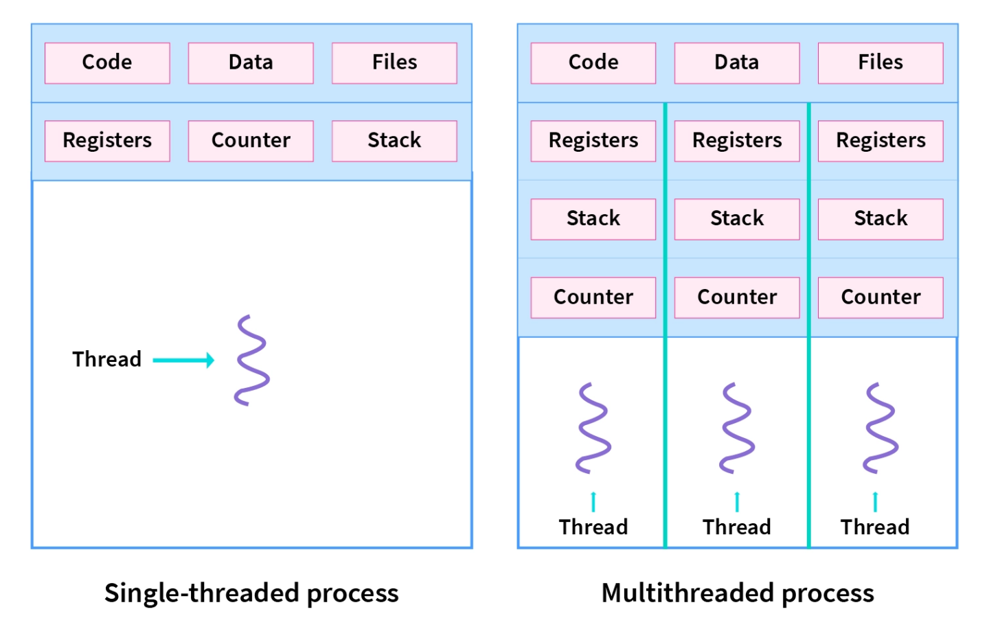

为什么需要线程？更方便资源共享，进程是资源分配的最小粒度；创建、销毁和切换的开销代价比较小。

### User-Level Thread

由用户态，也就是进程自己管理线程，操作系统不可知。

pros：

* 开销小
* 自定义调度策略
* 方便移植

cons:

* 只有一个CPU可以执行
* 一个线程阻塞其余也阻塞
* 只有一个线程yield之后其余线程才能获取运行权

### Kernel-Level Thread

内核负责线程的调度，切换线程的时候涉及到模式切换。

优点是当线程阻塞的时候，OS可以调度另一个线程运行；多个线程可以真的在多个CPU上面运行。

缺点是开销比较大，OS的调度策略不一定合适。

## 进程/线程调度
### 理解几个调度目标
* burst time：total time taken by the processor for its execution on CPU (excluding wating for IO)
* arrival time: 进程进入ready状态
* response time: 从就绪到第一次获取响应的时间

* Batch System
	* 吞吐量：单位时间执行的进程数
	* 周转时间：从创建到完成，创建之后不一定被马上执行，中途也可能终止运行。
* 交互式系统
	* 响应时间：从创建到第一次获得相应，比如鼠标的移动、键盘的输入
	* 等待时间：等待CPU的时间

### 几种常见的调度策略

针对批处理系统：

1、 First Come First-Served 先到先服务

如果是长任务先到达，会显著推迟后续短任务的执行。平均周转和响应时间会增加。当该任务需要等待IO的时候，会一直阻塞CPU。

2、 短作业优先

优先调度运行时间短的，所有任务同时到达会有最后平均周转时间（贪心算法），会导致**饿死现象**，因为对某种任务有偏好，在这里是短任务

3、剩余最短时间优先

抢占式，每当发生进程进入/调度的时候就要重新计算剩余时间，优先选择最短任务进行执行。和SJF一样可以优化周转时间，但都会有饿死现象。

针对交互式系统的调度算法：

1、 时间片轮转

利用时钟中断进行切换，如果任务提前结束了也可以进行切换。**不会优先什么任务，不会导致饿死**。但是进程切换开销大，频繁的切换，所以需要精心设计时间片长度。如果任务同时到达，该算法会导致比较高的周转时间，因为任务被切分成多个时间片运行了。

2、优先级调度

给每个进程不同的优先级，不同优先级队列可以使用不同的调度算法。

3、多级反馈队列

多个优先级队列，时间片用完到下一个优先级。会导致长任务大概率到最后的优先级，可能会导致**饿死现象**，感觉更偏爱短作业。

* 队列个数
* 初始优先级设置
* 每个队列的时间片长度，不同的调度算法

真实世界的调度算法

CFS：Completely Fair Scheduler

设定一个调度周期，在这个周期内所有任务都会被雨露均沾。time slice = sched_latency / #task。
但是随着任务数量增加，时间片会太短，系统会有一个保证的最小时间，保证time slice比较合理。
使用加权的方法来确定每个进程的使用时间（nice值被映射到一个权重值）

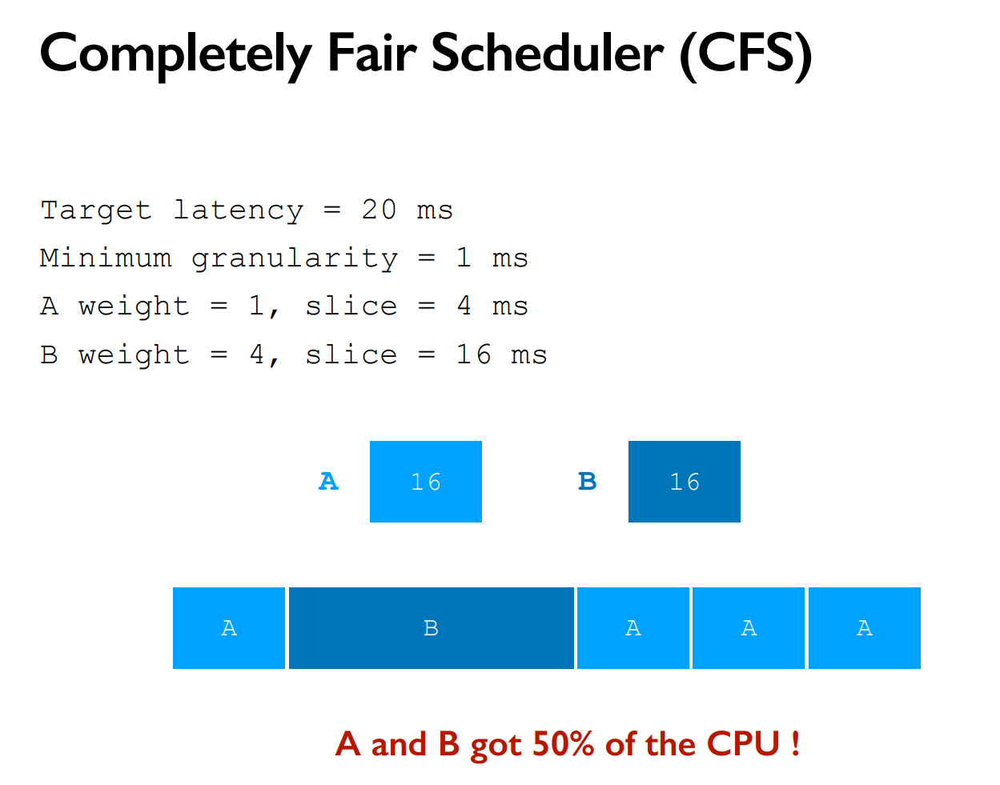

## 虚拟内存

地址空间是进程所能看到的一片连续的地址范围。进程看到的是虚拟的、大容量的、连续的私有的地址空间。对于硬件来说，真实的内存是一个有限的、被多个进程共享的地址空间。所以操作系统引入了虚存的概念，这是对实际物理内存的一个抽象。

在Linux系统中，每个任务有一个mm_struct结构，将一个地址空间划分为多个连续的area片段。
为了实现虚拟内存，必要的任务是进行**地址转换**，将一个虚拟地址转换为实际的物理地址。
利用地址转换可以实现**动态重定位**，在运行过程中将进程加载到不同的物理地址。
还可以实现**地址隔离保护**，不同进程映射到不同的地址空间，而且不能相互访问。
可以实现**内存共享**，只要将某个地址段映射到同一块内存空间即可。
还可以创建**拥有无限地址空间的假象**，只需要将不同地址在不同时间映射到同一块区域即可？

### 连续内存空间管理

1、**base and bound法**

使用Base and Bound两个寄存器来划分每一个进程的地址空间，切换上下文只需要改变这两个寄存器的value。
管理方式：①bitmap，将内存划分为多个相同的小单元 ②Linked List

两种碎片：①外部碎片：分块之间的空间太小太零碎无法利用②内部碎片：分区内未利用的

动态内存分配问题：如果从最适合的位置分配可能会产生更多的外部碎片，所以从最大的位置分配。只要是动态内存分配都或多或少会导致一些外部碎片。

malloc并不一定就是在Heap上分配，对于小容量高频分配会在heap上使用brk(), brk()的作用是向上拓展堆的顶部地址，从而扩大heap的大小；对于低频大容量使用mmap分配。

2、**分段 Segmentation**

将进程的地址空间视作一组分离的段，每个段可以有自己的base and bound。

**地址共享**：不同进程的拥有相同的段表即可。

由于段的大小不一致，所以会导致动态内存分配问题。

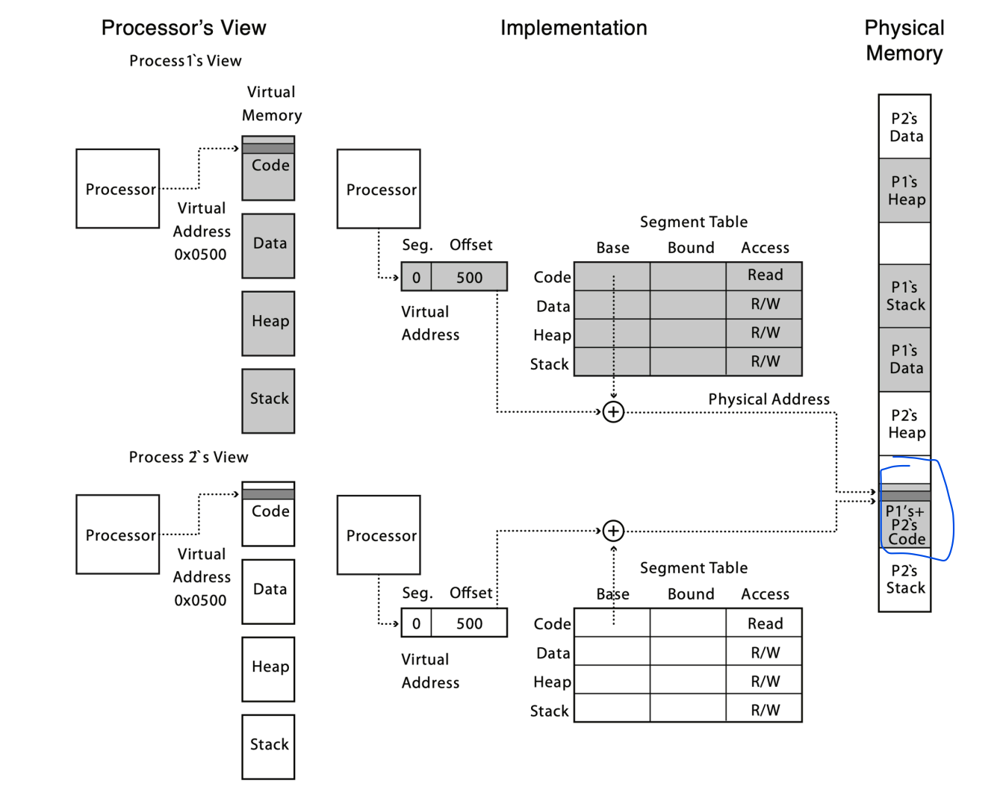

3、**分页 Paging**

将内存分为多片**相同大小**的页（4K、64K等等），建立虚存到实际内存的一个映射即可，没有外部碎片问题。

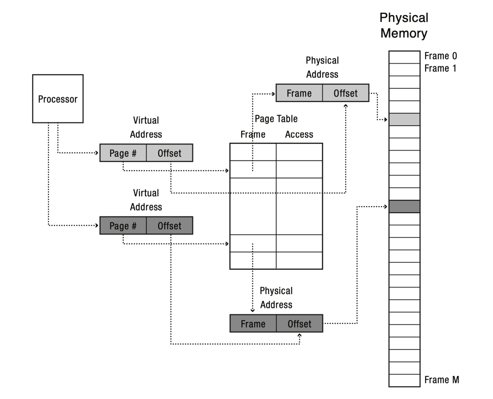

PTE通常会包括物理页框号、存储控制信息，按照bytes or words对齐。

分页模式下的几个机制：

**内存共享**：多个进程同时映射到一片内存区域即可

**写时复制**：只要能共享就一直共享，直到某个区域发生了修改才进行复制（成为该进程独有的），Linux中的一种懒机制。

### 线性页表的问题

#### Too Big

由于我们需要记录每一个页项的映射关系，最终的PTE数量就会比较大，占用很多的内存空间。如果单纯的增加页的大小又会导致内部碎片问题突出。解决方法是使用多级页表，将连续的PTE进行分页存储。

要保证最外层的页表可以放在一个页里面，否则还要继续分。

#### Too Slow

地址转换的开销比较大，特别是涉及多级页表的情况。我们借鉴Cache的思路，将页表项进行缓存。这是通过CPU中的MMU中的TLB实现的。TLB hit的时候直接访问，miss的时候更新到TLB中。

### 请求调页机制

为了让单个程序的虚拟内存空间可以超出实际物理内存空间，可以将一部分暂时不需要的页放到磁盘中，需要的时候才调度进来。需要有一个preset bit作为标记。如果访问的时候，该页不在物理内存中，会发生Page Fault异常，然后陷入到内核中进行调度。

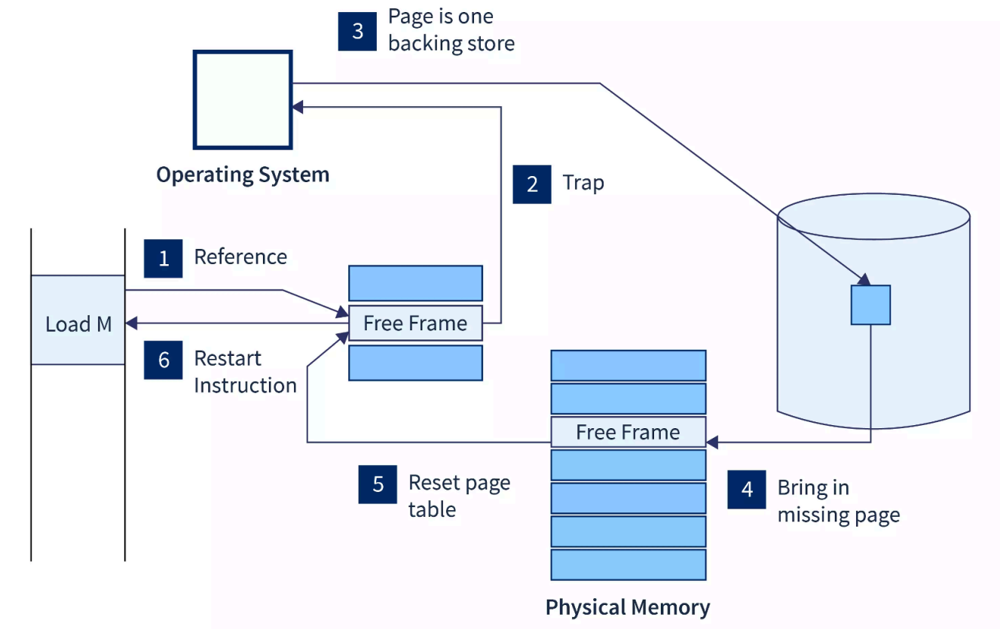

如果内存中没有空闲页框了，则会选取一定的替换策略，挑选一个页框替换下去，修改PTE相关设置，检查内容是否被改变，如果发生了改变会写回磁盘。

#### 替换策略

1、FIFO，替换最先进来的，但是会有Belady现象，增加页框个数反而带来更高的Page Fault Rate

2、LRU，替换最近未使用，维护成本高！

3、优化后的LRU，只看最近一个时钟周期，Second Chance。

#### Thrashing机制
如果一个进程分配到太少的页框，则无论选用什么策略，都会导致比较高的Page Fault Rate。此时可以kill掉一些进程，但是调度器又会swap in更多进程，最终表现为**低CPU利用率、高IO率**

## 互斥

多线程会带来很多意想不到的错误:)

1、 Not Atomicity 非原子性

多线程，特别是在多CPU情况，对一个共享内存区域进行操作。我们无法保证读写的顺序，会导致数据竞争现象。即使我们将一个指令明面上看似变成了单一指令。但是现代CPU的特性可能会拆分成很多个小的指令，这些指令执行的顺序是无法保证的。

2、No Consistency 一致性缺失

软件和硬件之间会协调好一个内存模型，包括强一致性，弱一致性等等不同的模型。我们不能保证自己写下的代码的顺序，就是真正的执行顺序。

使用互斥机制可以保证不同线程访问临界区资源是相互排斥的。互斥除了保证不发生同时进入临界区，还得保证一个正在等待临界区资源的线程有机会进入临界区。

### Lock

如何正确地实现一把锁？

1、关闭中断

不太现实，因为这不是一个用户级程序可以允许做的事情，同时关闭中断会导致系统的卡死。

2、使用Load and Store

如果test和set之间是分离的，不能保证原子性，则会导致两个线程同时进入临界区。比如当一个线程while(flag==1);通过之后，立马切换到线程B，则两个线程都会进入临界区。

3、Peterson's Algorithm

表达自己的意愿flag=True，谦让对方先进入，turn = 对面。但实际上谁先谦让反而是自己先进入临界区。但这种算法只适合两个线程的，而且现代CPU也无法保证它的正确性了。

4、Atomic Exchange(xchg)

使用一个原子指令，保证获取旧值和新值是原子性的。

上述的方法实现的是spin lock，如果无法获得锁会一直自旋下去，影响性能。而且还可能会导致其它线程永远无法获得锁。

一种可能的改进策略是使用Ticket Lock，即取号的机制。这样可以保证想要锁的线程一定可以拿到锁。

5、Sleep和Wakeup

当线程无法获得锁的时候，sleep掉，然后等锁被释放的时候唤醒。有可能在sleep之前一个锁被释放了，但是这个sleep永远不会被唤醒。Linux的futex就实现了类似的机制。

使用Spin还是Block要看具体的负载情况。Spin成功可以直接进入临界区，但是失败了会一直自旋。Block实现避免了spin的长时间等待，但是申请和释放都会进入内核态。可以结合两者的优势，实现一个**两阶段锁**。

### Condition Variables 条件变量

实现同步，线程之间执行的先后顺序。

* wait
调用的时候需要持有互斥锁。如果条件不满足会释放互斥锁并且阻塞该线程。当阻塞的线程被唤醒的时候会持有这把锁。
* signal
唤醒正在等待该条件变量的线程。

使用的注意事项：

* 使用共享变量来声明系统状态
* 使用mutex对共享变量进行保护
* 总是在持有锁的情况下使用wait和signal
* 在条件返回的时候应该使用while检查条件是否满足

#### 生产者消费者问题

#### 读者写者问题

### Semaphores 信号量

带有整数状态的条件变量，和一个整数值相关联。该整数可以用来表示系统拥有的资源数量。当资源数量为0/1的时候，就可以用来当做互斥锁和简单的顺序控制。

* 用于实现互斥，信号量初始1
* 实现同步，信号量初始0，先执行的那个线程执行V操作。

### 并发bugs

#### Atomicity Violation

本应该原子性执行的代码没有被加锁导致的Atomicity Violation

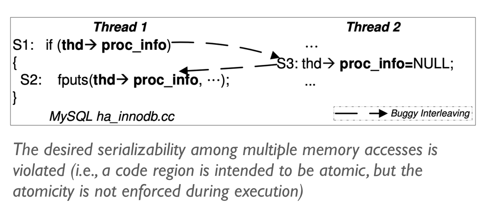

#### Ordering Violation

没有保证正确地同步

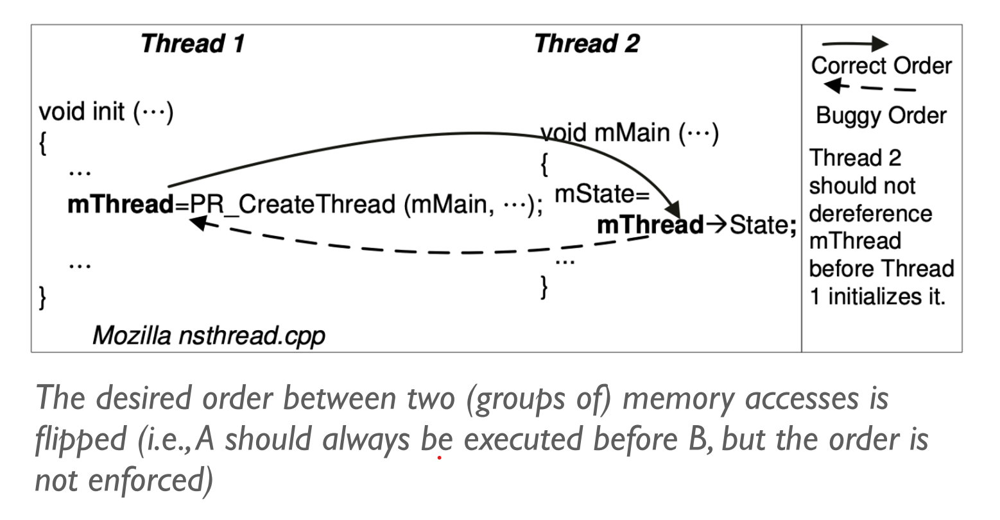

#### Dead Lock

每个线程都在持有一些资源，同时又在等待获取其它线程正持有的另外一些资源，从而导致相互等待。

单一线程也可能导致死锁，比如尝试获取两次lock

死锁的四个必要条件（即只要是死锁，一定会呈现出来的特征）

* Mutual Exculusion: 对资源使用是互斥的
* Hold and Wait: 持有一些资源的同时在等待另外的一些资源
* No preemption: 获取到的资源不能被抢占
* Circular Wait: 循环等待资源

对于哲学家问题，想要破除死锁，就可以从破坏上述的条件出发。比如，限制吃饭的人数，保证拿叉子总是先拿小的那一个（破坏了循环等待）

## 文件
文件是操作系统为了存储信息而创建的一个虚拟概念，一个文件就是一个按照名字存取的字符序列(an array of bytes)。命名提供了一个有意义的名称来引用系统中的特定数据。

文件分为数据部分和元数据部分。

### 文件描述符

指向操作系统对象的指针。在UNIX设计哲学中，Everything is a FILE。通过指针可以访问“一切”。

操作系统总是分配最小的未使用描述符。新打开的文件总是从3号文件符开始打开。

我们可以将文件描述符看作是进程操作文件的一种能力，不同的进程可能会打开相同的文件，但是以不同的权限方式打开。

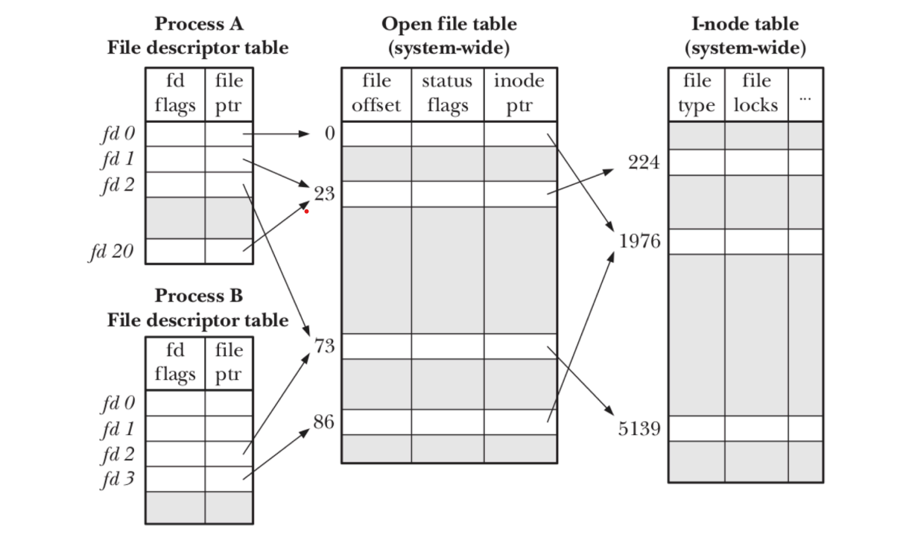

**文件描述符是进程状态的一部分**，使用fork创建新的进程的时候，文件描述符会被继承。但这带来一个问题，offset到底记录在哪里？我们可以在子进程关闭那个文件，然后重新打开，则会在System-wide的Open File Table增加新的一项，拥有自己的offset，但是inode-ptr都是指向同一个。

任何可以读写的东西都是一个文件

* 真实的设备文件 /dev/sda
* 虚拟的文件 /dev/null, /proc

对于一个流式的数据，使用文件描述符挺好的。但是对于有结构的字节序列数据，使用mmap可能更加方便。

### 文件系统 File System

文件系统可以看作是操作系统内核中的一部分，负责实现文件接口并负责管理文件数据和元数据的系统。它向上屏蔽了底层的驱动细节，不同的设备只要实现同一套接口即可，比如read write等等。

磁盘的组织管理

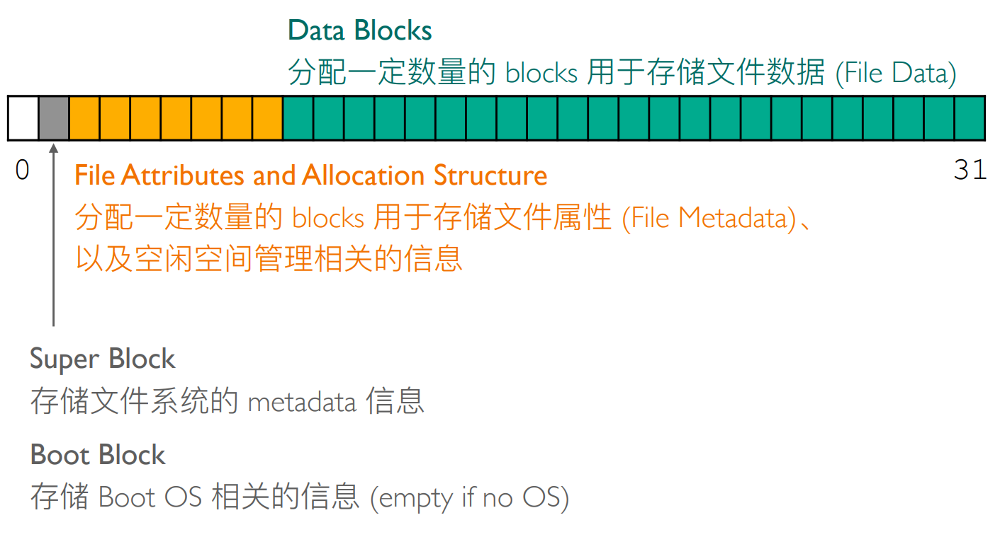

文件系统需要维护一个特定的数据结构来实现对文件的存储和管理，即File Control Block。在UNIX操作系统中，这样的结构被称为inode。

如何实现文件的定位，有三种实现方式

* 连续方式：会导致比较多的碎片空间，但是便于顺序读写。
* 链表方式：例如FAT中的File Allocation Table，只需要额外记录开头的节点号。该FAT表还可以缓存在内存中，加快文件的读写。但是随着磁盘空间的变大，该索引表会变得很大。
* 索引方式：比如UNIX文件系统中的inode structure

ext2文件系统采用了索引的方式，同时为了便于大文件和小文件都获取到比较好的性能，它采用了直接索引和多级索引两种方式。

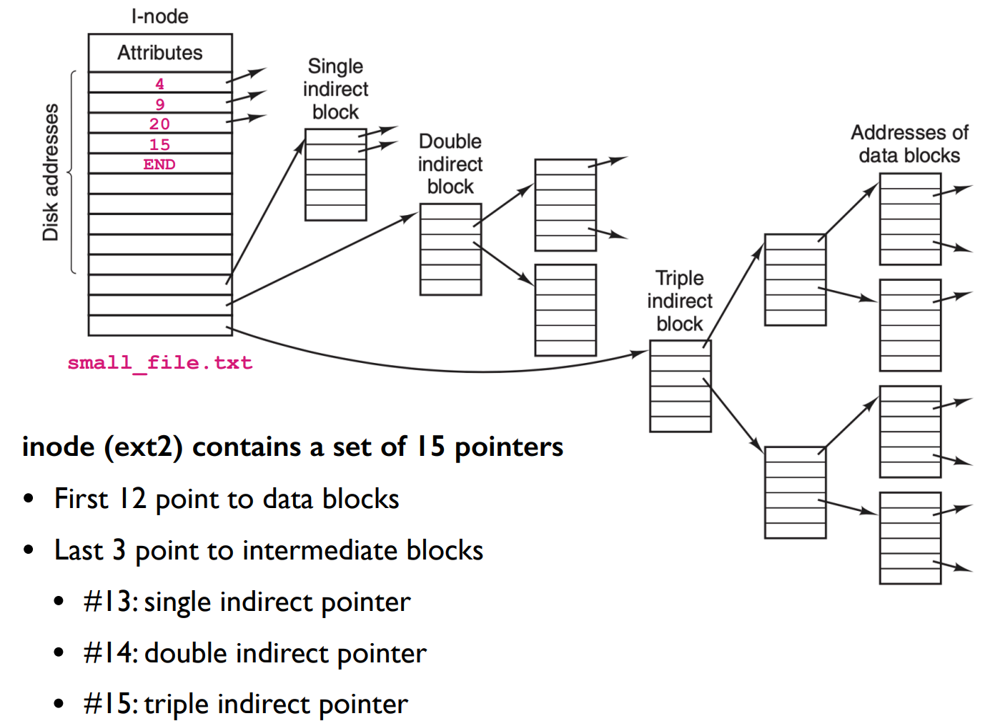

现在我们可以根据File Metadata找到文件的数据块了，问题只剩下如何寻找到这个File Metadata。一般来说，文件的Metadata存放到目录项中，每一个目录项就可以看作一个文件的metadata，它通常会记录文件的名字，属性和第一个数据块(inode块的位置)。

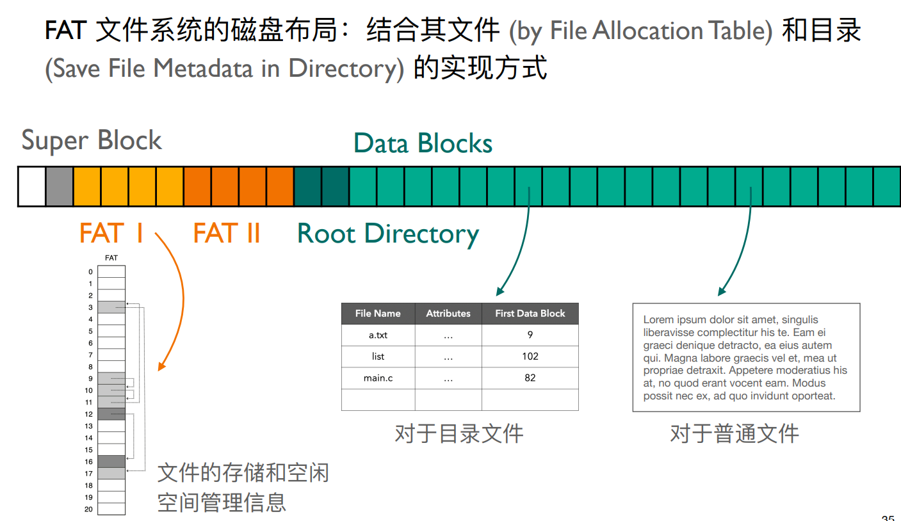

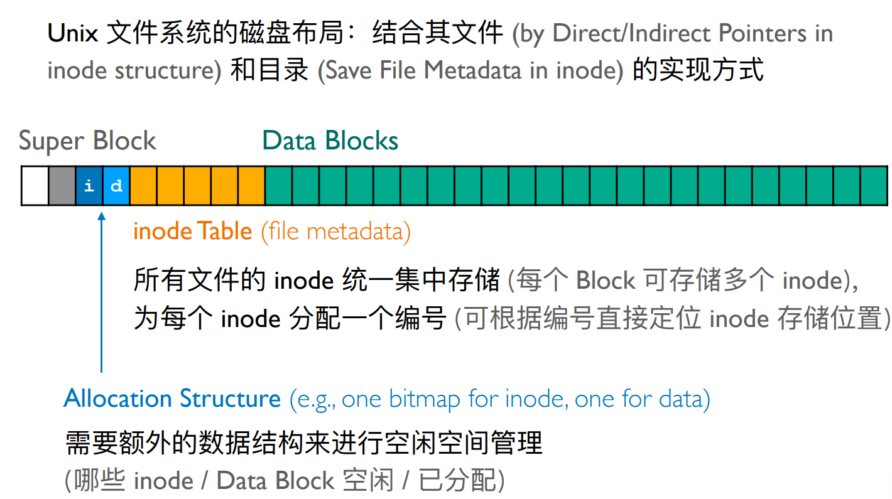

### 文件的链接

在UNIX世界中，我们可以以不同的名称来引用同一个文件，创建Link有两种方式：硬链接和符号链接。

* 硬链接：将文件名Link到Target File的inode，指向同一个文件
* 符号链接：文件中存放了Target File的Pathname，每次打开的时候需要重新解析路径。

### 文件系统的一致性问题

**Crash-Consistency**：确保文件系统总是从一个一致性状态原子地到另外一个一致性状态。

文件系统的更新涉及到了多个数据结构的更新，我们无法保证这些数据结构是原子性被更新。

* 事后检查： File System Consistency Check
* 提前预防： Journaling

#### 日志文件系统

通过在对文件系统进行更新之前多做一些额外的事情保证系统重启时的一致性。在更新之前将更新的意图记在一个日志中。
如果系统崩溃发生在Journal之前，则什么也不做，发生在Journal之后，则重做Journal中记录的事情。

为了降低开销，我们可以使用Metadata Journaling，即只在日志系统中记录metadata，用户数据直接写入到磁盘中。因此可以划分为两种模式，一种是先commit再写数据，另一种是写了数据再commit。为了保证不读取到垃圾数据，Linux的文件系统采用的是先写数据，然后再写metadata的模式。

## 设备管理

TODO

## 可执行文件

elf是一个人类不太友好的文件格式。使用elfcat来生成一个可视化的html文件。

elf文件可以看作是对程序状态机的初始状态的静态描述。 

elf文件就是一个“数据结构”。我们的binutils无非就是将这个数据结构的部分内容解释出来了。

## 构建真实可用的操作系统世界

Linux程序启动后会执行第一个程序，init。然后系统会执行initramfs，来创建一个在RAM中的文件系统。该文件系统包括了/ /bin /dev/console等等目录。

接着会创建busybox中的一些文件的别名。

然后系统通过一系列的syscall来逐步构建我们真实可用的操作系统。其中关键的一个系统调用是switch_root，将磁盘中的文件系统叠加到RAM中去。

## SIMD与SIMT
### SIMD
随着小核的频率无法再提高，Intel开始横向拓展多核心CPU。为了进一步提高整体的能耗比，开始区分大小核。
在指令集设计方面，为了迎合多媒体的应用场景，开始出现SIMD指令集，支持同时对多个数据单元进行同样的数据操作。 
### SIMT
对多个“位置”采取同样的一个操作。我们可以直接开启很多的线程来并行这个操作。
多个处理核心可以有自己的regs，ALU，但是PC是可以共享的。也就是同步同一条指令，但是regs的值可以不一样。